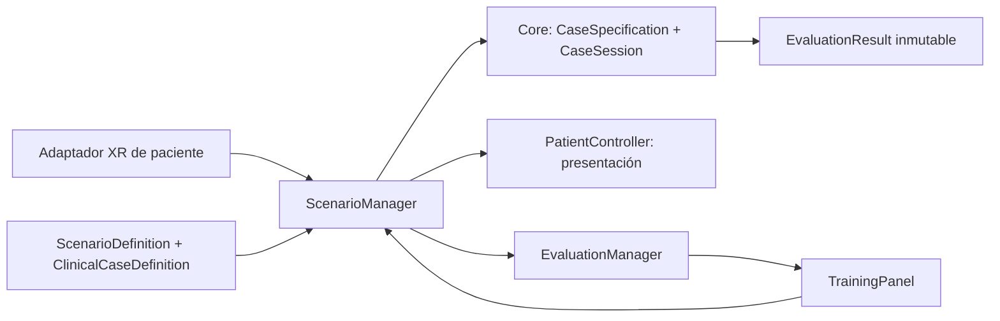

# Arquitectura

## Dependencias

`EmergencyVR.Core` no referencia Unity, escenas, Input System ni dispositivos.
`EmergencyVR.Runtime` traduce interacciones y presenta estado; `EmergencyVR.Editor`
prepara assets/configuración y compila la APK. Los tests no entran en el Player.

## Datos y sesiones

- `ScenarioDefinition`: ID, nombre, ruta de escena y caso predeterminado. Bootstrap
  carga por esa ruta, que debe estar en Build Profiles. La sala contiene su propio
  ScenarioManager; no hay singletons persistentes ni referencias entre escenas.
- `ClinicalCaseDefinition`: ScriptableObject de autoría, estado inicial y lista
  ordenada de pasos con ID, texto, estado de entrada/salida, puntos y plazo.
- `ToDomain()` valida y copia a `CaseSpecification`. La sesión no cambia cuando
  se edita el asset durante Play Mode. No se serializa la sesión dentro del asset.
- `CaseSession`: un intento. Empieza en el estado del caso, acepta acciones,
  produce transiciones y finaliza en un resultado inmutable. Otro intento crea
  otra instancia; un caso activo no puede reiniciarse accidentalmente desde UI.

La fase 2 inicial usa una **secuencia lineal validada**. No hay aún un grafo de
desenlaces, fisiología, degradación temporal o motor médico. Un paso puede mantener
el estado; la validación comprueba que la cadena sea alcanzable desde el inicial.
Los IDs de los pasos deben ser únicos y son sensibles a mayúsculas.

## Registro y evaluación

Las acciones entran por `ScenarioManager.SubmitAction(actionId)`, con tiempo
monotónico `Time.realtimeSinceStartupAsDouble`. El dominio recibe el tiempo como
argumento para que las pruebas no necesiten Unity ni relojes reales.

- Acción esperada: avanza y aplica `toState`.
- Acción futura: `OutOfOrder`; no avanza ni cambia el paciente.
- Acción ya aceptada: `Duplicate`; no vuelve a otorgar puntos.
- Acción ajena al caso: `Unknown`.
- Una acción esperada fuera de plazo se registra como `Late`, avanza, pero obtiene
  cero puntos. El plazo se mide desde el inicio del caso; 0 desactiva ese límite.
- `Finish` registra como omitidos los pasos pendientes; puede ejecutarse antes de
  completar la secuencia. Una segunda finalización devuelve el mismo resultado.
- Tras finalizar se rechazan nuevas acciones. No se cambian los registros guardados.

Fórmula inicial:

`puntuación = clamp(100 × (puntos a tiempo − errores × penalización) / puntos máximos, 0, 100)`

Los errores son acciones desconocidas, repetidas o fuera de orden. Las tardías se
cuentan por separado. Un paso omitido no otorga puntos. Este scoring es técnico y
deberá reemplazarse o configurarse según una rúbrica clínica aprobada.

El resumen vive en memoria; no hay exportación, usuarios, almacenamiento ni datos
personales. La auditoría conserva IDs, tiempos y disposiciones. El reloj incluye
el tiempo en segundo plano; pausa por retirada del visor queda para otra iteración.

## Paciente y presentación

`PatientState` tiene valores explícitos para conservar serialización. El dominio
decide transiciones; `PatientController.Present` recibe un estado y actualiza un
placeholder con MaterialPropertyBlock, sin clonar materiales en cada interacción.

`OnStateChanged` es un evento Unity al que más adelante se pueden conectar
animaciones, diálogo, sonido o expresiones. No se ha implementado audio ni Animator.
Los colores actuales solo sirven para depuración y se acompañan de texto en la UI.

## XR y renderizado

Rig oficial `XR Origin (XR Rig)` de Starter Assets 3.3.2. El generador ajusta ambos
`ControllerInputActionManager`: smooth motion=false, smooth turn=false. Conserva
los bindings del sample y configura SnapTurnProvider=30°. Desactiva salto, escalada
y movimiento por agarre. Tracking origin=Floor; fallback de altura 1,6 m.

Los cuatro pads usan la capa de interacción XRI 31 del teleport oficial. Es una
**máscara de interacción XRI**, distinta de las capas físicas de Unity. Cube y
paciente usan la capa de interacción predeterminada. Se mantiene la selección
por Grip y la UI por Trigger de Starter Assets. No se implementan bindings propios.

El cubo usa Rigidbody + XRGrabInteractable; se repone si cae por debajo de la sala
y no está agarrado. El paciente usa XRSimpleInteractable; seleccionar emite una
acción semántica. Hand tracking futuro debe producir esa misma acción, sin llevar
lógica médica al interactor.

UI: Canvas world-space, TrackedDeviceGraphicRaycaster, XRUIInputModule y EventSystem.
URP: Simple Lit en geometría del proyecto, HDR desactivado, MSAA 4x, sin sombras,
sin postprocesado ni texturas de cámara de profundidad/opaca. Estos son ajustes
iniciales; no equivalen a mediciones de rendimiento.

## Crear otro caso sencillo

1. Project → `Assets/_Project/ScriptableObjects/Cases` → clic derecho →
   Create → Emergency VR → Clinical Case.
2. Inspector → `Case Id`: identificador único; `Display Name`: nombre visible.
3. Elegir `Initial State`; añadir `Steps`. Cada `From State` debe coincidir con
   el estado resultante del paso anterior. Usar IDs únicos y puntos positivos.
4. Asignar el asset en `TrainingRoom.asset` → `Default Case`.
5. Asegurarse de que los adaptadores emitan los IDs del caso. La demo actual emite
   `demo.inspect` y `demo.confirm`; cambiar solo el texto no crea nuevas interacciones.

Una secuencia con otras transiciones/plazos/pesos y esos mismos IDs no requiere
reescribir el motor. Nuevos procedimientos necesitarán sus adaptadores y reglas.
No marcar `Clinically Approved` hasta que exista validación externa; el flag es
metadato de autoría, no una certificación ni un control de acceso.

## Extensiones previstas, todavía no implementadas

RCP: fuente de eventos de compresión → métricas puras → reglas configurables.
DEA: máquina de estados independiente, decisiones por caso y número de descargas.
Signos: datos de lectura y procedimiento separados del GameObject del dispositivo.
Desenlaces: reglas explícitas o grafo de transiciones, con validación y tests.
Ambientes: escenas/prefabs de entorno reutilizando los mismos adaptadores.

No se han creado clases vacías de procedimientos médicos ni valores clínicos por
defecto que aparenten sistemas funcionales.
