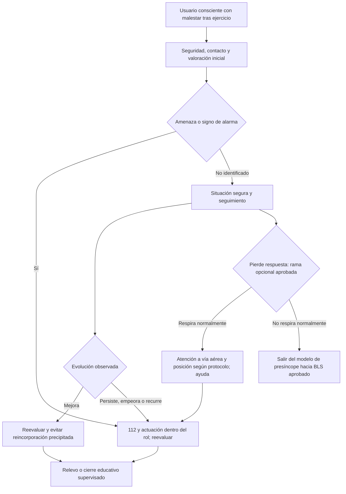
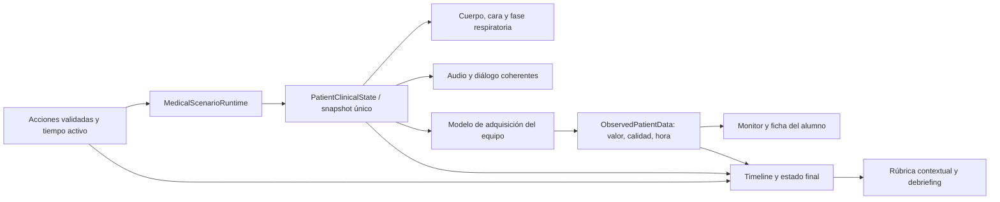

# CLINICAL IMPLEMENTATION SPEC — HIPOTENSIÓN SINTOMÁTICA

**VITAL VR · Gimnasio · Fase 1 · Propuesta v0.1 · 23 de septiembre de 2026**

**Estado: PROPUESTA CLÍNICA DEL CASO LISTA PARA REVISIÓN. NO APROBADA PARA IMPLEMENTACIÓN.**

Caso auditado: `review-hypotension-v1`. País confirmado por el promotor: **España**. Uso previsto: entidades compradoras que forman a nuevos compañeros, con posible apoyo de personal titulado. **La titulación del facilitador, el perfil del alumno y su formación previa aún no están definidos. BLOQUEO CLÍNICO BC-01.** No se interpreta «personal titulado que ayude» como autorización para que todos los alumnos actúen como sanitarios.

Esta entrega contiene investigación, auditoría y diseño. No modifica el catálogo, código, escenas, ScriptableObjects, animaciones ni configuración de Unity. Los nombres de estados, campos, eventos y animaciones que siguen son contratos propuestos, no clases ni assets creados.

## Cómo leer y aprobar esta especificación

- **EVIDENCIA:** recomendación o conocimiento localizado en una fuente identificada en C.
- **DISEÑO PROPUESTO:** decisión de autoría para construir un paciente ficticio y una experiencia evaluable; una guía no prescribe sus números, diálogos, animaciones ni tiempos exactos.
- **REQUIERE VALIDACIÓN CLÍNICA:** punto que debe revisar un profesional sanitario competente en este ámbito antes de convertirlo en comportamiento o puntuación del producto.
- **BLOQUEO CLÍNICO:** impide cerrar el itinerario, activar evaluación sumativa o pasar a implementación clínica. No impide presentar esta propuesta para revisión.

Las secciones J, K, L y T son **candidatas condicionadas al perfil**, no un repertorio aprobado de actuaciones correctas para los compradores. La aprobación del desarrollador habilitará la siguiente fase de trabajo; no sustituye la validación sanitaria señalada en W.

## Auditoría del caso existente

Revisión por lectura del código y del catálogo, consulta del grafo del repositorio y examen de la [captura Desktop existente](screenshots/experience/05-training.png). No se ha abierto ni ejecutado Unity en esta fase. La captura prueba una vista concreta de la entrega anterior, no todas las posturas ni el funcionamiento en Quest.

| Hallazgo verificable | Consecuencia para este caso | Decisión propuesta |
| --- | --- | --- |
| El [catálogo](../Assets/_Project/Resources/MedicalScenarios.json) lo llama «Hipotensión sintomática», categoría Síncope. El incidente es genérico y los antecedentes no están confirmados. | No distingue pérdida de conocimiento, pródromo, ejercicio ni mecanismo. | Definir una situación educativa concreta; no diagnosticar por el título. |
| Estado base: consciente, supino, FC 78, TA 85/55, SpO2 97%, FR 16, glucemia 5 mmol/L, temperatura 37 °C, dolor 0. | Una instantánea plausible no explica causa ni respuesta a la asistencia. | Conservar el dato de TA como candidato de autoría y justificar un conjunto completo, no copiarlo como evidencia clínica. |
| Varía edad entre 24–72 años, sexo, FC, SpO2 y glucemia; la postura permanece supina. | Cambia el contexto de riesgo sin historia específica para cada variante. | Fijar una persona y un guion antes de añadir variaciones validadas. |
| Diálogo inicial: «Me mareo; ya respondo y respiro normalmente». `visibleSigns` sigue describiendo un placeholder sin modelo anatómico. | La voz explica al alumno la evaluación; el texto está desactualizado respecto al avatar articulado. | Expresión natural y signos observables; corregir la descripción en la futura versión. |
| `PositionPatient` vuelve a poner supino a un paciente ya supino y no modifica sus constantes. | Se premia una acción nominal sin cambio clínico observable. | Reconocer postura segura ya existente y validar una transición solo cuando sea necesaria. |
| Único evento temporal a 60 s: aviso de observación, sin efecto fisiológico. Las dos ramas finales ordinarias son `REQUIRES_ADVANCED_CARE`. | No hay respuesta ni deterioro clínico modelado para este caso. | Introducir estados, reevaluación y desenlaces diferenciados; no arresto automático. |
| Nueve acciones obligatorias valen 10 puntos cada una. TA y SpO2 son obligatorias; pedir ayuda requiere haber registrado respuesta. | Puede imponer instrumentos y orden sin relación con competencias o prioridad. | Evaluar objetivos y condiciones, admitir ayuda paralela y excluir instrumental fuera del itinerario. |
| [MedicalScenarioRuntime.Submit](../Assets/_Project/Scripts/Medical/MedicalScenarioRuntime.cs) penaliza `Duplicate`, incluso para una nueva TA o reevaluación. `dangerous` genera error crítico aunque el campo `critical` sea falso. | Repetir una observación apropiada puede perjudicar la nota; caminar/abandonar tienen severidad generalizada. | Distinguir actos repetibles, contexto y severidad. No cambiar el comportamiento de los otros 43 casos sin versionado y regresión. |
| [MedicalPhysicalTool](../Assets/_Project/Scripts/Medical/Interaction/MedicalPhysicalTool.cs) acepta preparación, proximidad menor de 0,14 m, acoplamiento y espera común de 2 s. | No demuestra talla de manguito, señal, apoyo, inmovilidad o ciclo real. | Contratos de adquisición por dispositivo en O. |
| [MedicalProcedureRig](../Assets/_Project/Scripts/Medical/Interaction/MedicalProcedureRig.cs) crea el mismo kit: DEA, TA, pulsioxímetro, glucómetro, teléfono, autoinyector y vendaje. | Sugiere que todo el instrumental corresponde a cualquier caso. | Inventario por escenario e itinerario. |
| [PatientVisualState](../Assets/_Project/Scripts/Patient/Presentation/PatientVisualState.cs) y [PatientVisualController](../Assets/_Project/Scripts/Patient/Presentation/PatientVisualController.cs) ya traducen snapshot a postura, conciencia, respiración y coloración. | Existe una base útil; no procede otro motor de paciente independiente. | Extender esa misma cadena y sus capacidades faciales. |
| La respiración visual usa FR y fase acumulada; [MedicalProcedureAudio](../Assets/_Project/Scripts/Medical/Interaction/MedicalProcedureAudio.cs) ajusta el pitch de un loop separado. | Coincidir en frecuencia no asegura sincronía tórax–audio. | Compartir fase respiratoria y eventos de voz. |
| La captura muestra un avatar de apariencia masculina con torso descubierto, supino en el suelo. El catálogo puede generar sexo y edad distintos. | Falta coherencia entre identidad, indumentaria, motivo de consulta y cuerpo representado. | Persona fija, ropa de gimnasio y exposición solo justificada por una maniobra. |
| El gimnasio tiene cinta, banco, mancuernas y zona de recuperación; [ScenarioEnvironmentPresenter](../Assets/_Project/Scripts/Environment/ScenarioEnvironmentPresenter.cs) reutiliza carro/equipo y coloca al paciente cerca del suelo. | Hay geometría aprovechable, pero no una historia específica del incidente. | Reorganizar funcionalmente en S, conservando recursos útiles. |
| La [interfaz clínica](../Assets/_Project/Scripts/UI/TrainingExperience.Clinical.cs) ya separa lecturas adquiridas de valores de ayuda. | Es una buena base, pero el modo guiado revela todos los valores y la ficha aún no representa una entrevista. | Información progresiva; separar estado real, datos obtenidos y capa didáctica. |

La única referencia clínica asociada al caso actual es una página divulgativa NHS sobre hipotensión. Su revisión indicada es julio de 2023, con revisión prevista en julio de 2026; no basta para sustentar una rúbrica profesional. El documento histórico [MVP_SCOPE_AND_MEDICAL_REVIEW](MVP_SCOPE_AND_MEDICAL_REVIEW.md) ya dejaba pendientes público, país y criterios. Sus descripciones de implementación no reemplazan la lectura del código actual.

## A. Resumen clínico y delimitación

**Propuesta principal:** «Presíncope con hipotensión tras finalizar el ejercicio». Puede mantenerse «Hipotensión sintomática» como nombre comercial, acompañado de ese subtítulo en el material del instructor. En evaluación, el aviso inicial será «Una persona se encuentra mal en la zona de cardio», para no regalar el hallazgo ni el diagnóstico.

La situación simulada será una persona adulta que **no ha perdido el conocimiento al inicio**, se ha detenido después de hacer ejercicio y presenta sensación de desmayo y debilidad. La hipótesis de diseño es una intolerancia transitoria a la postura erguida en la recuperación del esfuerzo. La disminución del efecto de la bomba muscular y la vasodilatación residual ofrecen un mecanismo plausible, pero su extrapolación a este gimnasio es **inferencia de diseño**, no diagnóstico demostrado ni frecuencia de ocurrencia tomada de estudios de carreras [S06].

La TA baja es un hallazgo; el alumno debe valorar a una persona sintomática, protegerla y detectar necesidad de ayuda. No se exige diagnosticar vasovagal, deshidratación o una enfermedad cardiaca.

| Término | ¿Describe este guion? | Distinción que debe preservar el producto |
| --- | --- | --- |
| Hipotensión sintomática | Sí, si la TA se obtiene correctamente y concuerda con la clínica. | No identifica por sí sola la etiología. |
| Presíncope | Sí, propuesta de entrada. | Sensación de desmayo sin pérdida completa de conciencia [S05b]. |
| Síncope | No al inicio. | Reservar el término para una pérdida transitoria de conciencia compatible; rama opcional en G. |
| Síncope vasovagal | No confirmado. | Un patrón compatible y una respuesta favorable no prueban el mecanismo. |
| Hipotensión ortostática | No demostrada. | Requiere historia y valoración postural apropiada; una TA aislada no equivale a la prueba [S07]. |
| Episodio posterior al ejercicio | Sí, contexto deliberado. | Distinguirlo de un colapso **durante** esfuerzo; esa diferencia modifica la sospecha de riesgo [S04, S05a]. |

**Categoría candidata:** «Presíncope y síncope». **Dificultad candidata:** inicial para reconocimiento y protección; un itinerario con adquisición instrumental tendrá objetivos adicionales. Cambiar etiquetas no autoriza aún a editar el catálogo.

**Peligros que enseña:** caída, deterioro no reconocido, movilización inapropiada, falsa tranquilidad por una lectura aislada y demora en pedir ayuda. **Diagnósticos de seguridad que no deben confundirse:** arritmia/enfermedad cardiaca, síndrome coronario, hemorragia, anafilaxia, hipoglucemia, enfermedad por calor, convulsión y enfermedad neurológica aguda. No se insertarán todas estas patologías en el mismo intento. Si aparece un signo incompatible con la variante, se activa una vía de alarma y reevaluación; no se renombra silenciosamente como «vasovagal» [S01, S04, S05a].

## B. Público objetivo y competencias

**Confirmado:** España; compradores que capacitan a compañeros nuevos; posible participación de personas tituladas. **No confirmado:** titulación del facilitador, rol del alumno, formación en primeros auxilios, competencia instrumental, protocolo de la organización y comunidad autónoma.

**BC-01 sigue abierto.** No hay base para asignar por defecto el rol de enfermería, médico, TES o socorrista. El comprador, el facilitador, el alumno y el revisor clínico son cuatro roles diferentes.

| Itinerario propuesto, todavía no aprobado | Requisitos a acreditar por la entidad | Alcance de diseño | Límite |
| --- | --- | --- | --- |
| I0 · Iniciación como primer interviniente no sanitario | Objetivos de formación y apoyo del instructor definidos. | Reconocimiento, seguridad, comunicación, protección y solicitud de ayuda. | No supone competencia en instrumentos, diagnóstico ni tratamientos profesionales. |
| I1 · Primeros auxilios con instrumental no invasivo | Formación específica y protocolo que incluya cada dispositivo. | Añade contratos de TA y/o SpO2 de O. | No convierte medir en prescribir. |
| I2 · Profesional sanitario | Profesión concreta, funciones y protocolo aprobados. | Posible ampliación clínica en una revisión separada de esta especificación. | No agrupar médico, enfermería y TES bajo permisos idénticos. |

La recomendación de producto es disponer de **itinerarios explícitos**, no un interruptor «soy sanitario» que desbloquee todo. Mientras no se cierre BC-01: navegación y especificación pueden revisarse, pero los instrumentos se consideran opcionales condicionados y la evaluación clínica figura **NO EVALUABLE**. El facilitador puede explicar, observar y hacer debriefing; no debe suplir con opiniones improvisadas las reglas aprobadas [S01, S11].

España se incorpora en el guion de comunicación con el **112** [S12]. Antes de distribución, el responsable local verificará protocolo del centro, formación exigible y condiciones aplicables al uso del DEA en la comunidad autónoma concreta. Aquí no se declara que exista una habilitación nacional uniforme ni se adopta el número 999 de documentos británicos.

## C. Fuentes, vigencia y límites de la investigación

Consulta realizada en esta fase el **23-09-2026**. Se priorizaron organizaciones profesionales y organismos oficiales. No se utilizaron blogs ni publicidad como evidencia clínica. Los manuales de fabricante se usan exclusivamente para funcionamiento del dispositivo, no para justificar tratamientos.

| ID / fuente enlazada | Año / localización | Recomendación o aportación utilizada | Traducción a VITAL VR |
| --- | --- | --- | --- |
| **S01 · [ERC First Aid](https://www.erc.edu/media/i2vllpae/gl2025-12-faid-e.pdf)** | 2025; tabla 1 y apartados de evaluación/posición. | Atención según capacidades, reconocimiento de amenazas y posición ajustada a respuesta y respiración. El presíncope dejó de incluirse por reducción del alcance, no por demostración de ineficacia. | Permisos por itinerario y barrera de seguridad ante deterioro. No atribuir las maniobras de presíncope a esta edición. |
| **S02 · [AHA / American Red Cross First Aid](https://cpr.heart.org/en/resuscitation-science/2024-first-aid-guidelines)** | 2024; §6.8, presíncope. | Posición segura; contramaniobras cuando el cuadro sea vasovagal/ortostático y la persona pueda realizarlas. Solicitar emergencias si no mejora en 1–2 min, aparece síncope, empeora o recurre. No usar contramaniobras ante síntomas de infarto/ictus. | Política de escalada y alternativa condicionada; nunca esperar al plazo si existe alarma. |
| **S03 · [ILCOR, First Aid Evidence Updates](https://www.ilcor.org/uploads/FA-2025-Appendix-B-Evidence-Updates.pdf)** | Compilación 2025; FA 7550, pp. 30–33; ficha aprobada 06-12-2023. | Mantiene recomendación de contramaniobras para presíncope vasovagal/ortostático; evidencia de certeza baja/muy baja. Favorece miembros inferiores frente a superiores con recomendación más débil. | Alternativa opcional, no tarea obligatoria ni garantía de recuperación. La fecha de compilación no convierte toda la evidencia en estudios de 2025. |
| **S04 · [ESC, diagnóstico y manejo del síncope](https://www.escardio.org/guidelines/clinical-practice-guidelines/all-esc-practice-guidelines/syncope/)** y [artículo, §4.2.9](https://academic.oup.com/eurheartj/article/39/21/1883/4939241) | 2018. | Diferencia contexto de esfuerzo y recuperación; evaluación etiológica y de riesgo. | Historia precisa y ausencia de diagnóstico automático. El [calendario ESC](https://www.escardio.org/guidelines/clinical-practice-guidelines/guidelines-development/guidelines-publication-schedule/) sitúa la próxima guía de síncope en 2027: no presentarla como publicada. |
| **S05a · [NICE CG109](https://www.nice.org.uk/guidance/cg109/chapter/Recommendations)**; [versión pública verificable](https://www.nice.org.uk/guidance/cg109/ifp/chapter/Initial-assessment) | 2010, actualización 2023. | Historia del episodio, antecedentes, signos de riesgo y diferencia entre síncope durante y después del esfuerzo. | Preguntas dirigidas y relevo; no extender automáticamente una guía de pérdida de conciencia a un diagnóstico de presíncope. |
| **S05b · [NICE CG109: términos](https://www.nice.org.uk/guidance/CG109/chapter/terms-used-in-this-guideline)** | Glosario de la guía. | Distingue presíncope, síncope reflejo e hipotensión postural. | Nombres de estados y lenguaje del debriefing. |
| **S06 · [Exercise-associated collapse: postural hypotension, or something deadlier?](https://pubmed.ncbi.nlm.nih.gov/20086459/)** | 2010; revisión, resumen indexado. | Relaciona el colapso tras ejercicio con pérdida de bomba muscular y vasodilatación; exige considerar causas graves. | Justifica investigar el contexto, no fija probabilidades, cifras o tiempos del gimnasio. |
| **S07 · [AHA: Orthostatic Hypotension in Adults With Hypertension](https://professional.heart.org/en/science-news/orthostatic-hypotension-in-adults-with-hypertension/top-things-to-know)** | 2024. | Definición clásica: caída sostenida ≥20 mmHg sistólica o ≥10 diastólica dentro de 3 min de ponerse de pie. | No etiquetar ortostatismo por una cifra aislada ni provocar bipedestación peligrosa para obtener puntos. |
| **S08 · [AHA: Measurement of Blood Pressure in Humans](https://www.ahajournals.org/doi/pdf/10.1161/HYP.0000000000000087)** | 2019; declaración científica, técnica de medición. | Dispositivo validado, manguito adecuado, brazo descubierto y apoyado a nivel cardiaco. | Validaciones de colocación; adaptar postura a la situación aguda, no retrasar ayuda para cumplir un protocolo de cribado de hipertensión. |
| **S09 · [FDA: Pulse Oximeter Basics](https://www.fda.gov/consumers/consumer-updates/pulse-oximeters-and-oxygen-concentrators-what-know-about-home-oxygen-therapy)** | Página vigente consultada; informa de actuaciones de 2025. | La lectura tiene limitaciones por perfusión, movimiento y otros factores, incluida pigmentación. | Calidad de señal y datos no válidos; un número normal no descarta un problema circulatorio. |
| **S10 · [Nonin Onyx Vantage 9590, IFU 113634-001-01](https://www.nonin.com/wp-content/uploads/113634-001-01_ENG.pdf)** | Revisión documental identificada; año no confirmado en la copia consultada. | Inserción y orientación del dedo, comprobación de señal; equipo para comprobaciones puntuales, sin alarma de SpO2. | Referencia técnica posible, no selección comercial aprobada. No convertir el clip en monitor hospitalario. |
| **S11 · [INACSL, catálogo de estándares](https://www.inacsl.org/healthcare-simulation-standards-of-best-practice-)** y [síntesis oficial Simulation Design](https://inacsl.memberclicks.net/assets/Simfographics/25simfographics/INACSL_SIMULATION%20DESIGN_2025.pdf) | Estándares con revisiones 2025 para prebriefing/debriefing; diseño y objetivos conservan sus referencias específicas. | Objetivos observables, consulta a expertos, preparación, evaluación, pilotaje y reflexión estructurada. | Objetivos D, revisión W, pilotaje y debriefing U. No se declara acreditación INACSL. |
| **S12 · [Administración General del Estado: emergencias](https://administracion.gob.es/tu-espacio-europeo/derechos-obligaciones/ciudadanos/asistencia-sanitaria/numeros-urgencia)** | Página vigente consultada en 2026. | Acceso a emergencias en España mediante 112. | Teléfono, interlocutor y comunicación localizados. |
| **S13 · [RCUK: ABCDE](https://www.resus.org.uk/library/abcde-approach)** | Recurso institucional; no atribuirle edición 2025 si no figura. | Valoración y reevaluación; FR adulta orientativa de 12–20/min. | Coherencia respiratoria, sin imponer exploraciones profesionales a I0. |
| **S14 · [NHS: hipotensión](https://www.nhs.uk/conditions/low-blood-pressure-hypotension/)** | Revisado 11-07-2023; revisión prevista vencida 11-07-2026. | Relación entre presión baja y síntomas como mareo, náusea, debilidad o visión borrosa. | Apoyo divulgativo secundario; no sustenta por sí solo la conducta ni la nota. |
| **S15 · [RCUK Adult BLS](https://www.resus.org.uk/professional-library/2025-resuscitation-guidelines/adult-basic-life-support-guidelines)** | 2025. | Reconocimiento de parada ante ausencia de respuesta y respiración ausente/anormal. | Ruta de seguridad independiente, sin inducir RCP por hipotensión con respuesta conservada. Adaptar comunicación a España. |
| **S16 · [CDC: prevención en medición de glucemia](https://www.cdc.gov/injection-safety/hcp/infection-control/)** | 2024; recurso vigente consultado. | Dispositivos de punción de un solo uso para medición asistida, eliminación segura y descontaminación del medidor. | Condición de una eventual ampliación sanitaria; no habilita punción en el itinerario inicial. |

**Diferencias y acceso:** ERC 2025 no aborda específicamente presíncope; se complementa con S02/S03, no se afirma consenso idéntico sobre todos los detalles. AHA concreta criterios de llamada para ese contexto; la orientación general ERC favorece pedir ayuda precoz. El diseño acepta la llamada temprana y nunca obliga a agotar 2 min. La elevación pasiva de piernas y las contramaniobras son cosas distintas: una es posición asistida, otra contracción muscular voluntaria. No son requisitos acumulativos.

La técnica de TA descrita para una medición estandarizada no implica mantener de pie/sentado a alguien sintomático ni esperar cinco minutos antes de protegerlo. La comprobación ortostática queda fuera del núcleo inicial; no se fusionan tiempos de distintas guías para inventar un protocolo.

S02 clasifica su orientación de escalada específica como 2b/C-EO, basada en opinión experta; no debe venderse como un umbral fisiológico demostrado. La posible preferencia por contramaniobras de miembros inferiores tiene menor fuerza que la recomendación general de utilizarlas en el contexto indicado por S03. No extrapolar esas maniobras al primer episodio de causa incierta como si el mecanismo ya estuviera confirmado.

Se consultaron las fuentes públicas enlazadas. El texto completo de NICE CG109/OUP tuvo restricciones de acceso; se contrastaron extractos indexados y páginas oficiales accesibles, sin afirmar una lectura integral. El portal CERCP ofrece el resumen español ERC 2025, pero su PDF excedió el límite de descarga del visor. El texto completo INACSL Prebriefing 2025 también tuvo restricción: se usó el catálogo y la síntesis oficial, no se inventaron criterios no accesibles. La selección final de modelos de instrumentos y sus IFU **REQUIERE VALIDACIÓN CLÍNICA/TÉCNICA**.

## D. Objetivos educativos medibles

Objetivos candidatos para concretar tras BC-01. No se exige que el alumno pronuncie un diagnóstico.

| ID | Conducta observable | Evidencia que registrará el intento |
| --- | --- | --- |
| O1 | Reconocer que la persona presenta un malestar con riesgo de caída y valorar respuesta/respiración. | Observación, preguntas, respuestas y momento de reconocimiento; no solo abrir una ficha. |
| O2 | Conseguir o mantener una situación corporal segura, explicando y respetando la ayuda. | Postura efectiva, consentimiento, entorno y continuidad del acompañamiento. |
| O3 | Obtener los antecedentes inmediatos y detectar señales que hacen necesaria una escalada. | Inicio durante/después del esfuerzo, pérdida de conocimiento, dolor torácico, disnea, palpitaciones y antecedentes relevantes. |
| O4 | Reevaluar al paciente y reconocer mejoría, persistencia o recurrencia. | Observaciones repetidas con hora y comparación explícita, aunque no haya instrumentos. |
| O5 | Solicitar ayuda y transmitir información útil para el relevo cuando corresponda a la rama. | Destinatario, localización, estado actual, evolución, acciones y mediciones realmente obtenidas. |
| O6 | Si I1/I2 lo autoriza, obtener e interpretar una medición válida sin retrasar la atención prioritaria. | Calidad técnica, lectura, unidad, hora y conducta; N/A en I0. |

El instructor verá objetivos y capacidades habilitadas antes de iniciar. El alumno conocerá su rol, los límites de la simulación y los controles; el prebriefing de evaluación no revelará la causa ni los valores ocultos [S11].

## E. Historia del paciente — propuesta de autoría

**Persona ficticia:** Daniel, 40 años, hombre, usuario recreativo del gimnasio. Se propone esta identidad para disponer de un caso reproducible y concordante con un avatar apropiado; no porque el cuadro sea propio de un sexo. La representación final y la eventual diversidad de variantes se validarán por separado.

Ha terminado una sesión de cinta, ha parado y ha bajado. Al estar quieto junto a la zona de recuperación nota mareo, visión que se oscurece y debilidad. Se sienta; un trabajador cercano solicita ayuda. No ha caído ni perdido el conocimiento al comienzo. La relación temporal exacta se plantea como **historia ficticia**, no como criterio diagnóstico suficiente.

Respuestas propuestas para entrevista: no dolor torácico, no falta de aire, no palpitaciones percibidas, no golpe, no sangrado conocido, no diabetes conocida ni medicación habitual declarada; comió antes de venir y bebió durante la sesión. Es el primer episodio que recuerda. No se añade ayuno, deshidratación, alcohol o sobredosis para justificar automáticamente un tratamiento. «No conocido» nunca equivale a una exploración negativa demostrada.

La enfermedad cardiaca y otras causas peligrosas no quedan excluidas porque el personaje niegue síntomas. El escenario enseña incertidumbre y relevo, no alta médica. Historia, intensidad del esfuerzo, intervalos e identidad: **REQUIERE VALIDACIÓN CLÍNICA**.

**Briefing del alumno:** «Estás en la zona de cardio. Un compañero te avisa de que un usuario se encuentra mal. Actúa dentro del rol que se te ha asignado. Puedes hablar con él y pedir colaboración al personal». El testigo conoce el comienzo del episodio y puede ayudar; no recita todo el historial sin que se le pregunte.

## F. Estado inicial y justificación de parámetros

**Posición propuesta:** sentado en un banco estable cercano, pies apoyados, tronco algo inclinado y una mano buscando apoyo. La inclinación no cierra la vía aérea. No se le coloca de pie sobre una cinta activa ni supino sin explicar cómo llegó allí.

Los valores siguientes son un **conjunto sintético candidato**, no valores indicados por una guía ni «normalidad» universal. Se propone fijarlos en el primer guion; no sortear cada constante independientemente. No activarlos sin revisión W.

| Variable | Valor/rango candidato | Justificación y presentación |
| --- | --- | --- |
| Conciencia y orientación | Alerta; reconoce quién es, dónde está y qué acaba de hacer. | Permite entrevista y cooperación; no asignar confusión basal a este presíncope. |
| Habla | Frases cortas por malestar, comprensibles, sin disartria. | Menor volumen y pausas; no incapacidad ventilatoria artificial. |
| FC / ritmo interno | Nominal 88/min; ventana de autoría 80–96, regular. | Compatible con recuperación de ejercicio sin imponer arritmia o bradicardia. La TA no determina una FC única. No mostrar ECG sin ECG. |
| TA | Nominal 85/55 mmHg; ventana 82–90/50–60. | Retiene como candidato el hallazgo actual, ahora ligado a síntomas; no afirma una relación universal entre cifra y conciencia [S14]. |
| FR | Nominal 18/min; ventana 16–20. | Patrón regular, profundidad conservada, sin esfuerzo accesorio; compatible con el marco orientativo adulto [S13]. |
| SpO2 | Nominal 97%; ventana 96–99% en aire ambiente. | Diseño sin insuficiencia respiratoria. Hipoperfusión y saturación arterial son fenómenos distintos; puede existir mala señal periférica sin hipoxemia [S09]. |
| Temperatura | Valor interno candidato 37,0 °C; 36,5–37,5. | Esta variante no se diseña como enfermedad por calor. Sin termómetro, no aparece como cifra conocida. La percepción táctil no genera una temperatura numérica. |
| Glucemia | Valor interno candidato 5,0 mmol/L, aproximadamente 90 mg/dL. | No se diseña hipoglucemia. No necesaria como instrumento en I0; sin adquisición autorizada queda desconocida. Su valor no mejora al pulsar una acción. |
| Dolor | Niega dolor; 0/10 si se pregunta por escala. | No mostrarlo antes de preguntar; dolor nuevo cambia la evaluación de riesgo. |
| Mareo / debilidad | Moderados, con sensación de desmayo y deseo de sentarse/tumbarse. | Síntomas relatados y conductuales, no una escala clínica numérica inventada. |
| Náusea / visión | Náusea leve, visión que se oscurece; sin vómitos ni déficit visual focal. | Pistas compatibles, no diagnósticas [S14]. |
| Piel / cara | Algo pálida respecto a su tono basal, sudor fino frontal; labios sin cianosis. | Evitar depender solo de color: voz, postura y relato también informan. No imponer palidez idéntica a todas las pigmentaciones. |
| Deglución | Alerta y capaz de manejar secreciones; no se deduce seguridad para toda ingesta solo de una variable. | En este núcleo no existe una tarea obligatoria de dar bebida/comida. |

Las ventanas son límites de revisión, **no distribuciones aleatorias ni objetivos terapéuticos**. Temperatura, glucemia y dolor se mantienen coherentes durante este episodio; no se alteran por conveniencia dramática. Una medición periférica no válida no cambia el estado real del paciente.

## G. Máquina de estados y signos vitales por estado

Separar **estado clínico** de **progreso del alumno**. «Ha reconocido el problema» no mejora la TA; «se completó la transición postural» puede ser una entrada al modelo aprobado. Hablar, medir o abrir el menú no cura al paciente.

Todos los estados y curvas son **DISEÑO PROPUESTO / REQUIERE VALIDACIÓN CLÍNICA**. Las constantes son internas; su conocimiento por el alumno depende de observación/adquisición. Estados 00–04 y 07 forman el núcleo propuesto; 05–06 son ampliación opcional bloqueada hasta validación específica.

| Estado | Conciencia, postura, expresión y animación | FC/min | TA mmHg | FR/min | SpO2 | Síntomas / diálogo | Tiempo y transición |
| --- | --- | --- | --- | --- | --- | --- | --- |
| **00 INITIAL_PRESYNCOPE** | Alerta, sentado con apoyo; incomodidad, mirada aún dirigida. `SeatedPresyncope`. | 88; rango F | 85/55; rango F | 18 | 97% | Mareo, debilidad, visión oscura. «Me estoy mareando». | Hasta postura segura/ayuda; no congelado: habla, respira y varían los síntomas dentro de su estado. |
| **01 SUPPORTED_OBSERVATION** | Alerta, transición asistida terminada a supino o alternativa segura validada; reduce tensión facial. `AssistedToSupine` → `SupineBreathing`. | 84–92 → 80–88 | 85/55 → candidato 95/60 | 16–20 | 96–99% | Sigue mareado al principio. «Así estoy un poco mejor». | Curva gradual candidata de decenas de segundos; alcanza 02 si mejoría consistente, o 03 si persiste. No respuesta garantizada. |
| **02 IMPROVING** | Alerta y orientado, supino; atención más estable. `Recovering`. | 76–88 | Candidato 100–110/60–70 | 14–18 | 96–99% | Mareo disminuye, cansancio residual. «Mejor, pero sigo flojo». | Observación y reevaluación; 07 al relevo. Si se moviliza y reaparecen síntomas, 04. No permiso automático para volver al ejercicio. |
| **03 PERSISTENT_SYMPTOMS** | Alerta pero incómodo, postura segura; palidez y debilidad persisten. `WeakSupportedIdle`. | 80–100 | 82–90/50–60 | 16–20 | 96–99%; señal puede ser insuficiente | «No se me pasa». | Reconocer persistencia y escalar según política M. Puede mantenerse fisiológicamente sin caer en parada; 07 con relevo. |
| **04 RECURRENT_PRESYNCOPE** | Alerta, intento de incorporarse interrumpido, busca apoyo; pérdida de estabilidad sin caída libre. `RiseAttempt` → `RegainSupport`. | 84–100 | Candidato 80–88/48–58 | 16–22 | 96–99%; posible artefacto | Vuelve la visión oscura. «Al levantarme me vuelve». | Vinculado a cambio postural real y variante autorizada; volver a situación segura y reevaluar/escalar. 01/03; 05 solo si esa rama fue aprobada. |
| **05 BRIEF_TLOC — opcional** | Pérdida transitoria de respuesta y tono, respiración espontánea normal. Sin habla ni seguimiento ocular. `SupportedLossOfTone`. | No fijar una curva sin validar mecanismo. | Transitorio descenso: **REQUIERE VALIDACIÓN CLÍNICA**; no fabricar una TA obtenida en segundos con manguito. | Debe seguir el patrón respiratorio validado; sin apnea/agónica por defecto. | Sin caída automática; lectura puede faltar por artefacto. | No habla; testigo responde. | Duración y condiciones pendientes de aprobación. Reevaluación inmediata; no temporizador de «esperar a despertar». 06 o salida de seguridad. |
| **06 EARLY_RECOVERY_AFTER_TLOC — opcional** | Recupera respuesta y orientación; cansancio, sin confusión prolongada guionizada. `RegainAwareness`. | Hereda curva validada 05→recuperación. | Hereda curva validada; nueva TA solo al completar adquisición. | Coherente con respiración observada. | Según señal y adquisición. | «¿Qué ha pasado?». | Observación, reevaluación y ayuda; 07. Confusión persistente obliga a reconsiderar el cuadro. |
| **07 HANDOVER / SESSION_END** | Hereda 02, 03 o 06; la llegada de ayuda no normaliza el cuerpo. | Heredada | Heredada | Heredada | Heredada | Resume síntomas actuales si puede hablar. | Finaliza tras transferencia explícita o cierre del instructor; conserva estado final real. |

En 00–04: temperatura y glucemia internas conservan F; dolor sigue ausente salvo una nueva rama clínicamente aprobada. En 05–06 no se implementarán constantes, duraciones ni síntomas de compromiso sin cerrar W: señalar la incertidumbre es preferible a inventar una trayectoria.

**Salida de seguridad:** si falta respuesta y la respiración no es normal, se sale del modelo de presíncope y se aplica el protocolo BLS aprobado del itinerario [S15]. En el núcleo aquí propuesto **no se genera una parada** como castigo. Un fallo técnico de audio/animación tampoco puede convertirse en deterioro clínico.

| Estado | Acciones disponibles del núcleo, sujetas a B | Conductas candidatas esperadas | Conductas a revisar como incorrectas según contexto |
| --- | --- | --- | --- |
| 00 | Hablar, observar, pedir ayuda, asistir posición; instrumentos solo I1/I2. | O1–O3, protección y comunicación. | Forzar marcha, minimizar síntomas, anteponer aparatos a una necesidad inmediata. |
| 01 | Acompañar, observar, entrevista breve, medir si procede. | Confirmar seguridad y respuesta, explicar, reevaluar. | Considerar que la animación completada equivale a curación. |
| 02 | Reevaluar, documentar, preparar relevo. | O4–O5; reconocer mejoría sin diagnóstico definitivo. | Alta automática o retorno inmediato a la cinta. |
| 03 | Solicitar/confirmar ayuda, actualizar información, reevaluar. | Reconocer persistencia y evitar demoras instrumentales. | Repetir acciones para acumular puntos sin responder al estado. |
| 04 | Detener incorporación insegura, asistencia y escalada. | Reconocer recurrencia como dato nuevo. | Ordenar continuar caminando pese a los síntomas. |
| 05–06 | Solo tras aprobación: respuesta/respiración, posición y ayuda según protocolo. | Conducta condicionada al estado real, no a etiqueta «desmayo». | Dar ingesta sin seguridad, continuar diálogo durante ausencia de respuesta, ignorar respiración anormal. |
| 07 | Comunicar y ceder atención. | Transferencia con hora, evolución y datos realmente conocidos. | Inventar cifras o dejar sin acompañamiento antes de un relevo efectivo. |

## H. Síntomas y paciente humano creíble

La progresión visible no será una animación de «daño». Ojos abiertos, mirada al interlocutor cuando puede atender, parpadeo discreto y períodos breves de mirada baja; tensión frontal suave y mano buscando apoyo. El personaje no debe girar todo el cuello para perseguir al jugador ni mantener contacto ocular cuando está sin respuesta.

La palidez cambia respecto al material basal, conservando matices de piel; sudor localizado y tenue. Náusea se expresa por pausa, deglución y frase, no necesariamente por vómito. Debilidad significa menor iniciativa y necesidad de apoyo, no temblor generalizado. **No se añade convulsión, espasmo, cianosis o jadeo por defecto.**

En recuperación mejora primero la capacidad de responder y sostener atención según la curva aprobada; el paciente puede seguir cansado. No debe «levantarse celebrando». Si se aprueba un intento de incorporarse, lo anticipa verbalmente y permite intervención del alumno; no una caída sorpresa imposible de evitar en VR.

La respiración tiene un ciclo visible de tórax/abdomen por cada ciclo clínico. A 18/min, el período es aproximadamente 3,33 s; no es una animación fija de 5 s. La amplitud es una representación artística aprobable, no una medición de volumen corriente. Voz y respiración se coordinan sin añadir una segunda fisiología.

## I. Árbol de decisiones

La llamada puede hacerse antes o en paralelo a la valoración. No es necesario medir TA o SpO2 para abrir la rama de ayuda. Las contramaniobras no son un peaje del árbol. El nodo clínico «mejora» no depende de que el alumno haya pulsado «reconocer hipotensión».

## J. Actuaciones candidatas a considerarse correctas

**Condicionadas a BC-01 y a validación; ninguna queda aún aprobada como rúbrica del alumno.** Se proponen resultados observables, no una secuencia rígida:

1. Identificar peligro inmediato, acercarse, presentarse y obtener cooperación cuando sea posible.
2. Comprobar respuesta y respiración mediante interacción/observación, sin exigir instrumentación para reconocer urgencia.
3. Conseguir protección ante caída y una posición segura aceptable para esa persona; comprobar el resultado de la asistencia.
4. Preguntar por comienzo y síntomas de alarma, con información proporcional al rol; detener la entrevista si surge una amenaza.
5. Reevaluar la evolución y solicitar apoyo/relevo según la política aprobada.
6. Comunicar datos reales, su hora y sus limitaciones. Si el itinerario incluye aparatos, aplicar O.

No se enseñarán en este núcleo prescripción farmacológica, acceso venoso, fluidoterapia, diagnóstico etiológico definitivo o alta deportiva. No son desbloqueables por obtener una buena nota. Las referencias de estas conductas se concretan en la matriz R01–R20; son una adaptación de autoría al escenario, no una transcripción de guías.

## K. Alternativas aceptables que debe admitir el evaluador

Propuestas a validar por el responsable sanitario:

| Situación | Caminos posibles | Qué no debe penalizarse por defecto |
| --- | --- | --- |
| Necesidad de ayuda | Llamar, delegar con confirmación o usar altavoz permaneciendo con la persona. | Llamada anterior a medición o a una entrevista completa. |
| Riesgo de caída | Asistencia a posición segura; permanecer sentado con apoyo mientras se organiza una transición adecuada. | No cumplir una animación única si ya está protegido y existe una razón válida. |
| Persona ya supina | Mantener y valorar esa postura si es adecuada. | No repetir «posicionar» solo para obtener puntos. |
| Contramaniobras | Considerarlas solo en una persona consciente, capaz y con patrón compatible, sin alarmas; no obligarlas. | Elegir protección/posición sin contramaniobra, o miembro superior si inferior no resulta viable [S02/S03]. |
| Elevación de piernas | Opción asistida a revisar según contexto, comodidad y ausencia de contraindicaciones. | Omitirla si se ha conseguido una situación segura; no exigir Trendelenburg. |
| Mediciones | TA/SpO2 solo en itinerario autorizado; reevaluación clínica sin instrumental. | No medir si no hay equipo/formación; interrumpir una medición para atender una prioridad. |
| Repetición | Nueva observación o medición tras cambio o resultado dudoso. | Repetir con motivo clínico; no confundirlo con doble clic accidental. |

Dar agua no es una tarea obligatoria ni una «cura» del episodio. Su eventual aceptación requerirá situación clínica, seguridad de ingesta y alcance aprobados; no se afirmará deshidratación por estar en un gimnasio. No se añade azúcar, sal, café u oxígeno como tratamiento automático de una cifra baja.

## L. Clasificación de errores candidata

La categoría depende de estado, oportunidad real de actuar, formación habilitada y consecuencia plausible. No depende solo del identificador de un botón. **Todas las severidades requieren calibración clínica antes de puntuar.**

| Categoría | Ejemplo contextual | Justificación / límite |
| --- | --- | --- |
| Crítico candidato | Ignorar una pérdida de respuesta con respiración anormal cuando la ruta de seguridad esté habilitada. | Amenaza vital no atendida [S15]; no aplicable si esa rama no existe. |
| Crítico candidato | Retrasar deliberadamente ayuda ante deterioro evidente o permitir una movilización claramente insegura pese a advertencias del paciente. | Riesgo de daño o de demora de asistencia; revisar circunstancias y delegación antes de atribuirlo. |
| Crítico candidato | Compresiones/descarga injustificadas sobre paciente claramente consciente; ingesta forzada con pérdida de respuesta. | Intervención incompatible con el estado. Detener la maniobra simulada; no representar daño gráfico. |
| Importante candidato | Confiar en lectura inválida, no reevaluar persistencia/recurrencia, confundir «SpO2 normal» con «sin riesgo». | Decisiones apoyadas en información insuficiente o errónea [S09]. |
| Importante candidato | Incorporación precipitada con síntomas, comunicación incompleta que omite deterioro. | Debe haber evidencia de síntomas percibibles y oportunidad de evitarlo. |
| Menor candidato | Registro incompleto de hora, explicación poco clara, colocación instrumental corregida antes de aceptar resultado. | Diferenciar proceso imperfecto de daño; un intento de aprendizaje corregido no equivale automáticamente a fallo crítico. |
| No evaluable | No medir por falta de competencia/equipo; orden alternativo válido; fallo de tracking o reconocimiento de voz; postura no representable por el sistema. | El producto no puede castigar una conducta que no permite ejecutar o demostrar. |

«Abandonar» requiere contexto: irse sin ayuda/relevo no equivale a delegar correctamente o desplazarse para llamar cuando no existe alternativa. Un mal acoplamiento por accesibilidad o latencia se registra técnicamente; no se convierte sin más en incompetencia clínica.

## M. Evolución temporal y consecuencias

**Hay dos clases de tiempo:** el reloj activo de la simulación y los intervalos clínicos de referencia. No confundirlos con contadores para perder puntos.

| Situación temporal | Comportamiento propuesto | Naturaleza del intervalo |
| --- | --- | --- |
| Desde que comienza 00 | Respiración, interacción, sudor y síntomas activos; el paciente expresa persistencia si nadie atiende. | Autoría; no repetir frases continuamente. |
| Primeros 30–90 s tras una intervención efectiva | Candidato a mejora gradual 01→02; también puede existir rama de persistencia 03. | **REQUIERE VALIDACIÓN CLÍNICA**. No es una promesa fisiológica ni un plazo normativo. |
| Persistencia, empeoramiento, recurrencia o pérdida de conciencia | Política de escalada; llamada temprana siempre posible. | La referencia específica de S02 incluye ausencia de mejoría a 1–2 min; no obliga a esperar ante gravedad. |
| Incorporación sintomática | Puede aparecer 04 tras cambio postural; transición corporal y relato antes de pérdida de equilibrio. | Evento condicionado, no deterioro aleatorio por abrir menús. |
| Inactividad prolongada | Persistencia y oportunidad de pedir ayuda; instructor puede cerrar «atención no completada». | Límite pedagógico candidato de sesión 5–8 min, no tiempo de supervivencia. |
| Solicitud de ayuda | El operador responde y hay un relevo representado. | Tiempo de llegada de autoría visible en debriefing; nunca promesa de respuesta real del 112. |

El reloj sigue mientras se consulta la ficha durante entrenamiento. La pausa explícita congela fisiología, fase respiratoria, voz e instrumentos y se registra como pausa. En evaluación debe acordarse política de pausa y ayuda antes de iniciar; no suspender automáticamente a alguien por necesitar ajustar el visor. La mejora puede producirse sin completar todos los ítems y un alumno competente puede encontrarse una rama que requiere ayuda: **resultado fisiológico y desempeño no son lo mismo**.

## N. Inventario de objetos

| Objeto | Decisión para este caso | Motivo y alcance |
| --- | --- | --- |
| Teléfono funcional / contacto con recepción | Núcleo propuesto. | Pedir colaboración y simular 112 con confirmación. |
| Banco estable y espacio protegido en suelo | Núcleo propuesto. | Apoyo y transición segura. No usar un banco de pesas con obstáculos como única opción. |
| Toalla/colchoneta fina disponible cerca | Accesorio opcional. | Comodidad/higiene; su ausencia no bloquea la ayuda ni exige ir a buscarla. |
| Botiquín señalizado, higiene de manos y guantes | Recursos del centro. | Utilización según riesgo de contacto, no guantes como peaje antes de hablar/proteger. |
| Tensiómetro automático de brazo y manguito de talla adecuada | Solo I1/I2 aprobados. | Caracteriza hallazgo; no obligatorio en I0. Modelo e IFU pendientes. |
| Pulsioxímetro de dedo para medición puntual | Solo si el objetivo I1/I2 lo justifica. | Complementa evaluación; no debe convertirse en ritual ni sustituir observación. |
| Reloj/contador | Disponible. | Registro de tiempo y eventual recuento respiratorio/pulso si está enseñado. |
| DEA del gimnasio en ubicación señalizada | Recurso de emergencia, cerrado en el núcleo. | No colocación de parches en presíncope con respuesta; accesible a la ruta BLS aprobada. |
| Glucómetro y material de punción | Excluidos del núcleo I0/I1 inicial. | No hay hipótesis ni objetivo que justifique exigir glucemia a todos. Posible módulo sanitario condicionado. |
| Fonendoscopio | Excluido del núcleo. | Se propone TA automática; auscultación añade otra habilidad y otra especificación. |
| Oxígeno, fármacos, sueros, autoinyector | Excluidos del kit de este caso. | No se justifican por su existencia en la demo ni por una TA aislada. |
| Vendaje/torniquete | Pueden permanecer dentro del botiquín ambiental, sin tarea aquí. | El guion no incluye hemorragia. No se puntúa usarlos preventivamente. |
| Monitor hospitalario / ECG | No disponibles. | Un gimnasio no adquiere monitorización hospitalaria por mostrar una HUD. |

No se prescribe la compra de marcas. El inventario final debe reflejar el equipo y las capacidades del centro formador [S01].

## O. Interacción realista de los instrumentos y zonas corporales

### O1. Contrato de adquisición común

Selección → preparación → colocación → validación de condiciones → adquisición → evaluación de señal/calidad → lectura con unidad/hora → comunicación → retirada/limpieza. Cada paso tiene evidencia propia. Una llamada a una función «acción completada» no produce por sí sola un número clínico.

Una adquisición fallida devuelve «Sin lectura» o «Lectura no válida», sin copiar el valor real oculto al panel. No todos los errores del mundo real son detectados por el aparato: la primera versión puede rechazar una técnica incorrecta de forma didáctica, pero debe explicitar esa simplificación; no inventará errores numéricos precisos sin un modelo validado.

### O2. Tensiómetro automático de brazo — condicionado a I1/I2

| Campo | Especificación propuesta |
| --- | --- |
| Función / cuándo | Obtener TA cuando el itinerario lo autorice y no demore una prioridad. Nueva lectura si cambia la situación o la previa es dudosa. |
| Uso | Identificar equipo y manguito, explicar, descubrir brazo sin comprimirlo con ropa, colocar según talla/IFU, apoyar brazo a nivel cardiaco y mantenerlo relajado [S08]. La postura del paciente sigue su seguridad, no una silla obligatoria. |
| Validaciones VR | Grip del manguito, zona de brazo superior, orientación y cierre plausibles, contacto alrededor del brazo, apoyo y movimiento. El medidor y el manguito son piezas funcionalmente distintas; la distancia al ancla no basta. |
| Secuencia / tiempo | Encender, colocar/conectar, iniciar ciclo, inflar y desinflar, obtener resultado, registrar, liberar y retirar. Ciclo candidato 30–60 s **solo como parámetro de prototipo**, pendiente del IFU del modelo; eliminar la espera universal de 2 s. |
| Resultado | TA adquirida durante un intervalo con postura, hora y calidad. Si el paciente cambia mucho durante el ciclo: invalidar/repetir o aplicar comportamiento documentado del modelo. No dar TA «instantánea». |
| Animaciones | Ofrecer/apoyar brazo, abrir/cerrar manguito, expansión moderada, tubo sin atravesar el cuerpo, gesto leve de presión y retirada. |
| Feedback | Pantalla de ciclo, sonido del motor y salida coherente. En práctica: motivo técnico tras error; en evaluación: aviso propio del equipo, sin decir la próxima acción clínica. |
| Errores | Manguito fuera de zona/talla, ropa, cierre incorrecto, brazo móvil o sin apoyo, retirada durante adquisición, lectura vieja comunicada como nueva. Tolerancias geométricas son técnicas y deberán probarse con usuarios. |

No simular compresión dolorosa progresiva ni fijar presiones máximas del manguito sin fabricante. La incapacidad de colocar una mano virtual con exactitud milimétrica no debe generar falsos fallos clínicos.

### O3. Pulsioxímetro — condicionado a objetivo y formación

| Campo | Especificación propuesta |
| --- | --- |
| Función / cuándo | Estimar SpO2 y, si el modelo la ofrece, frecuencia de pulso. Distinguir esta última de un diagnóstico de ritmo/ECG. |
| Uso / VR | Abrir clip, introducir dedo hasta posición admisible, orientación compatible, cerrar sin pinzar exceso y mantener quieto. No basta acercarlo al dorso de la mano. El manual S10 es una referencia de operación, no una marca obligatoria. |
| Secuencia / tiempo | Arranque, comprobación del equipo y adquisición hasta estabilidad suficiente. Ventana de animación candidata 10–30 s; valor final condicionado a señal, no a agotar un timer. Parámetro a validar con el modelo seleccionado. |
| Resultado | Lectura puntual y calidad; si hay mala perfusión/movimiento, no mostrar mágicamente 97%. Si se retira, último valor queda fechado como histórico, no «en directo» [S09/S10]. |
| Animaciones / sonido | Mano ofrecida, apertura/cierre, presión leve; sin alarma hospitalaria. No forzar bip continuo si el equipo elegido no lo tiene. |
| Feedback / errores | Dedo no insertado, clip girado, movimiento, contacto interrumpido, interferencia/condición de señal. No alterar SpO2 real porque el alumno colocó mal el clip. |

No introducir una corrección numérica arbitraria por raza o color de piel. La variabilidad de medida por pigmentación requiere validación específica y representación cuidadosa; nunca ocultar limitaciones ni usarla para penalizaciones imprevisibles.

### O4. Teléfono y comunicación

Función: pedir ayuda; accesible desde el comienzo. Coger o usar altavoz, simular 112, comunicar ubicación y acceso, estado observado y cambios, escuchar y confirmar. Delegar requiere respuesta del colaborador y confirmación de llamada. No realizar llamadas reales ni transmitir datos fuera de la aplicación.

Animaciones: coger, pantalla/altavoz, atención compartida con paciente. Audio: interlocutor grabado y adaptativo, subtítulos. Error evaluable: creer que la ayuda está activada sin confirmar; no penalizar una frase equivalente ni un acento que el sistema no reconozca. La llegada de ayuda es un evento independiente de coger el teléfono [S12].

### O5. Reloj, higiene y recursos ambientales

El reloj permite medir intervalos; observar tórax no rellena automáticamente una FR exacta. En el itinerario que lo enseñe, el alumno cuenta y registra; el sistema compara con los ciclos del mismo estado clínico. El método de recuento y su tolerancia **requieren validación**, sin crear ahora umbrales punitivos.

Higiene/guantes: dispensador y material visibles, uso vinculado a contacto y riesgo. Animación de colocación/retirada o abstracción explícita; feedback formativo, sin retrasar protección urgente por un gesto decorativo. Banco y suelo validan área libre, apoyo y trayectoria; la ausencia de colchoneta no vuelve incorrecta una posición segura.

DEA: en el núcleo puede localizarse/delegarse su búsqueda si el instructor lo contempla, pero su **aplicación no es un objetivo**. El contrato completo de parches/análisis/descarga pertenece al BLS ya existente y deberá revalidarse antes de activar esa rama. No se inventa aquí otro algoritmo.

### O6. Instrumentos excluidos y ampliación pendiente

Glucómetro: no se ofrece como atajo de diagnóstico. Si un futuro itinerario sanitario lo incorpora por indicación concreta, necesitará guantes/higiene, tira compatible, muestra real simulada y suficiente, punción con dispositivo de un solo uso, eliminación segura y limpieza. Acercar una tira sin muestra al dedo no produce glucemia. Proceso, modelo, tiempo, pertinencia y feedback: **REQUIERE VALIDACIÓN CLÍNICA** [S16]. No se asigna una nota por omitirlo aquí.

Fonendoscopio, oxígeno, autoinyector y fármacos no reciben una interacción clínica en este núcleo, porque no son instrumentos seleccionados para sus objetivos. No se añaden animaciones para sugerir tratamientos que no se han aprobado.

### O7. Zonas del paciente con propósito

| Zona | Propósito condicionado al estado | Validación / exclusión |
| --- | --- | --- |
| Cara / campo de atención | Conversación y observación de respuesta. | No es botón invisible de «diagnóstico». Sin dolor ni estímulos agresivos para obtener respuesta. |
| Hombro / brazo | Contacto suave y asistencia consentida; comprobación de respuesta si corresponde. | No tirar del brazo, levantar por muñecas o arrastrar el cuerpo. |
| Brazo superior | Manguito, en itinerario autorizado. | Zona anatómica, talla, orientación y apoyo. |
| Dedo | Pulsioxímetro; glucemia solo en ampliación sanitaria. | Sensores diferenciados; no resultados sin proceso válido. |
| Muñeca | Pulso radial si figura entre las habilidades enseñadas. | Detección/estimación no se transforma en ECG ni se exige a quien no se ha formado. |
| Tórax y abdomen | Observación respiratoria. | No obligación de desnudar/tocar para este cuadro; sin compresiones como tarea. |
| Cabeza / mentón | Solo maniobra de vía aérea si el estado y protocolo lo requieren. | No interacción invasiva ni giro automático en paciente consciente que habla. |
| Piernas / apoyo corporal | Asistencia postural opcional y validada. | Trayectoria segura; no levantar piernas arbitrariamente tirando de tobillos. |

## P. ANIMATION_REQUIREMENTS

Duraciones de producción propuestas, no ventanas fisiológicas. **Todas pendientes de revisión técnica y clínica.** Las animaciones expresan el estado; no deciden conciencia, TA o puntuación.

| Nombre | Descripción / trigger | Duración aproximada | Tipo | Región / blend | Estado |
| --- | --- | --- | --- | --- | --- |
| `SeatedPresyncope` | Sentado con apoyo, malestar contenido al inicio. | Ciclo 6–10 s | Loop variable | Cuerpo, pelvis estable; capa respiratoria/atención. | 00 |
| `SeekSupport` | Busca apoyo por debilidad o aviso de mareo. | 1–2 s | One shot | Brazo/tronco; hand IK hacia banco, transición gradual. | 00/04 |
| `AssistedToSupine` | Acepta ayuda y desciende controladamente a superficie libre. | 4–8 s | One shot | Cuerpo completo, root/path y contactos; mezcla desde postura real. | 00→01 |
| `SupineBreathing` | Reposo con respiración sincronizada. | Período = 60/FR | Loop continuo | Tórax/abdomen aditivos sobre pose estable; sin reiniciar fase. | 01–03/07 |
| `WeakSupportedIdle` | Debilidad persistente sin desplome repetitivo. | 6–10 s | Loop variable | Cara, manos y atención; conservar apoyos. | 03 |
| `Recovering` | Mayor atención, relajación facial y movimiento prudente. | Blend 3–6 s | Transición + idle | Cara/cabeza/miembros, guiado por tendencia clínica. | 01→02 |
| `RiseAttempt` | Pregunta por incorporarse e inicia movimiento autorizado. | 2–4 s | One shot interrumpible | Pelvis, manos, pies con IK; sin salto de posición. | 02→04 |
| `RegainSupport` | Interrumpe incorporación por mareo y recupera apoyo. | 1–3 s | One shot | Tronco y brazos, no ragdoll violento. | 04→01/03 |
| `OfferArm` / `RestArm` | Colabora para manguito sin mover todo el cuerpo. | 1–2 s | One shot + hold | Máscara de brazo, hand IK y límites articulares. | 00–03 |
| `OfferFinger` / `WithdrawFinger` | Colabora para pulsioxímetro y retirada. | 1–2 s | One shot + hold | Mano/dedos; evitar conflicto con manguito y postura. | 00–03 |
| `CuffInflationReaction` | Presión leve del manguito sin dolor dramático. | Durante ciclo | Capa transitoria | Brazo/cara; no alterar constantes por trigger. | Medición |
| `NaturalBlink` / `GazeAttention` | Parpadeo y mirada limitada al interlocutor. | Variable | Procedural | Ojos/cabeza; pesos según conciencia y atención. | Alerta |
| `SpeechVisemes` | Voz natural sincronizada con clip. | La del audio | One shot | Cara/mandíbula; mezcla con respiración y expresión. | Solo con respuesta |
| `PallorSweat` | Cambios suaves respecto a aspecto basal. | Según estado | Parámetro continuo | Material/cara; sin sobrescribir tono de piel. | 00–04 |
| `SupportedLossOfTone` — opcional | Pérdida de tono si se aprueba 05. | Pendiente clínica; transición visual tentativa 1–3 s | One shot | Cuerpo completo, colisiones y soporte; no caída aleatoria. | 05 |
| `SidePositionAssisted` — opcional | Cambio postural de seguridad si corresponde al protocolo. | 4–8 s tentativos | One shot | Cuerpo completo y apoyos; requiere espacio. | 05 |
| `RegainAwareness` — opcional | Recupera respuesta sin arrancar a hablar antes de tiempo. | Según estado aprobado | One shot + blend | Ojos/cabeza/voz; cancelación limpia de gesto previo. | 06 |
| `HandoverListening` | Escucha o permanece observado mientras llega ayuda. | 4–8 s | Loop discreto | Cabeza/atención; hereda pose, respiración y debilidad. | 07 |

**Criterios contra movimientos imposibles:** pies y pelvis apoyados, manos con objetivo compatible con longitud de brazos, barrido de trayectoria antes del traslado, límites articulares por avatar y ausencia de interpenetración visible. No mover el root y aplicar simultáneamente un clip que lo desplaza de nuevo. No sustituir una transición por rotar el cuerpo rígidamente. La ropa debe acompañar el cuerpo y permitir observación suficiente de respiración.

Se reutilizarán Animator/rig existentes. Capas enmascaradas, blend de poses y humanoid IK son candidatos documentados por [Unity](https://docs.unity3d.com/Manual/InverseKinematics.html), consultado con Context7. **Animation Rigging no se da por instalado ni necesario**: decidirlo tras identificar limitaciones del rig actual. Ojos simulados no significan eye tracking del usuario. Si el asset no tiene párpados/visemas utilizables, declararlo como carencia; no prometer expresión inexistente.

## Q. Voz y diálogos del paciente

Frases de autoría, a revisar con sanitario y actor. Español natural para España, subtitulado. No se diagnostica a sí mismo ni enumera signos vitales. Respuestas cortas con pausas por malestar, volumen algo bajo, sin disartria/confusión basal.

| Pregunta / evento | Respuesta candidata | Interpretación y condición |
| --- | --- | --- |
| Saludo y presentación | «Hola… sí, te escucho». | Alerta; una pausa breve, sin confusión. |
| «¿Qué te pasa?» | «He parado hace nada y me estoy mareando». | Relación temporal, no diagnóstico. |
| «¿Cómo es el mareo?» | «Como si me fuera a desmayar… se me oscurece un poco la vista». | Sensación subjetiva; no describir un giro de habitación salvo otra variante. |
| «¿Cuándo empezó?» | «Al bajar de la cinta y quedarme quieto». | Distinguir después de esfuerzo. |
| «¿Te has desmayado o golpeado?» | «No… me he sentado porque no me encontraba bien». | Solo en rama inicial; después de 05 debe cambiar. |
| Identidad/orientación | «Daniel… estoy en el gimnasio». | Responde a lo preguntado; no revelar automáticamente todos los datos. |
| Dolor de pecho / respiración / palpitaciones | «No me duele el pecho» / «No me falta el aire» / «No he notado que se me acelere». | Respuestas separadas; no sustituyen observación ni excluyen enfermedad. |
| Antecedentes y medicación | «Que yo sepa, no tengo problemas del corazón» / «No tomo medicación todos los días». | El matiz de incertidumbre es intencional. |
| Comida / bebida | «Comí antes de venir… y he bebido durante el entrenamiento». | No induce una receta automática de azúcar o agua. |
| Consentimiento para ayudar | «Sí, ayúdame, por favor». | Solo cuando la propuesta es comprensible y aceptable. |
| Mejora tras apoyo | «Así estoy algo mejor… todavía me noto flojo». | Solo si la curva mejora; no respuesta fija a cualquier botón. |
| Persistencia | «No se me pasa…». | Solicita reevaluación, sin decir cuál es la respuesta del examen. |
| Intento de levantarse | «Creo que puedo… uf, no, me vuelve el mareo». | Da tiempo a reaccionar; no aparece si no hay intento. |
| Interacción brusca o no explicada | «Espera… ¿qué vas a hacer?». | Feedback humano, no popup de puntuación. |
| Sin respuesta, rama 05 | Silencio del paciente; testigo: «Ahora no me contesta». | Detener voz, visemas y atención del paciente. |
| Recuperación de 05 | «¿Qué ha pasado?… te oigo». | Solo al recuperar respuesta; persistencia de confusión no pertenece al patrón aprobado por defecto. |
| Relevo | «Estoy algo mejor, pero sigo mareado» o «Sigo igual». | Selección por estado, no por nota. |

Cadencia propuesta: frases breves, una idea por turno, sin jadeo teatral; velocidad algo reducida en malestar y más natural en recuperación. Los valores exactos de velocidad/volumen son producción de audio, no diagnóstico. No interrumpir una llamada con frases automáticas repetidas. Reconocimiento de voz opcional; siempre alternativa de preguntas seleccionables semánticamente equivalentes, sin penalizar errores del reconocedor.

## R. Sonido

| Capa | Diseño propuesto | Condición / criterio |
| --- | --- | --- |
| Ambiente | Ventilación, actividad lejana y música tenue opcional. | Contexto de gimnasio; reducir mezcla al conversar/llamar. No tapar voz ni alarmas reales del visor. |
| Paciente | Voz espacial, respiración discreta y ropa al moverse. | Respiración comparte fase/FR con tórax; habla inhibida sin respuesta. No audio de asfixia por hipotensión. |
| Equipo | Motor/válvula del manguito, cierre de clip, teléfono. | Sonidos solo cuando la operación ocurre; no bips clínicos de utilería. |
| Feedback didáctico | Confirmación suave de interfaz y explicación posterior cuando proceda. | No sonido de «acierto» durante evaluación que revele el camino. |
| Emergencias | Voz del operador y llegada del relevo si se modela. | Subtítulos y pausa coherente; no sirena obligatoria ni tiempo de llegada real prometido. |

El panel informativo persistente **no es un monitor hospitalario físico** y no generará alarmas de UCI. Una lectura puntual antigua no emite latidos perpetuos. El control de volumen no cambia la fisiología; subtítulos permiten acceso al contenido sin sustituir objetivos auditivos específicos que no se puedan evaluar en esa configuración.

## S. Gimnasio: historia espacial y ergonomía

Se reutilizan la cinta, bancos, rack, iluminación y arquitectura procedurales. El protagonista debe estar en una zona de recuperación contigua a la cinta que acaba de usar. La cinta está detenida y el testigo puede explicar el recorrido. Un pequeño paño/botella propios pueden apoyar el contexto sin convertirlos en pistas de deshidratación.

Banco fijo sin ruedas, apoyo seguro y espacio de suelo libre para asistencia. Acceso por un lado suficiente para el alumno y por otro para colaborador/relevo, con dimensiones por validar en escala real y en Quest. No colocar pesas, cables ni una mesa clínica entre el alumno y el paciente. La seguridad ambiental debe poder observarse sin obligar a pulsar «escena segura».

Botiquín identificado cerca de recepción y DEA en punto visible/localizable mediante señalización; no ambos materializados a los pies del paciente. Si I1 incluye tensiómetro y clip, justificar que el centro dispone de ellos y representar quién los trae. Retirar de este caso el carro hospitalario y los instrumentos irrelevantes; conservar los recursos generales para otros escenarios.

Luz uniforme y estable para apreciar piel, ropa y movimiento; evitar flashes, bloom que oculte el color o sombras que simulen cianosis. Un trabajador/testigo es suficiente para dar información y colaborar; más personas solo si tienen una función, no por densidad visual. Señalar acceso para ayuda sin trasladar al paciente hacia la salida por conveniencia del diseño.

VR: posibilidad de intervención sentado o de pie según accesibilidad del alumno, recentrado, teleportación sin atravesar al paciente y zona de interacción alcanzable. El visor no debe obligar a arrodillarse en un suelo real no preparado. La cámara del alumno conserva seguimiento libre; la animación de asistencia pertenece al paciente y colaborador, no arrastra la cabeza del usuario.

## T. Scoring propuesto y modos educativos

### T1. Modelo de evaluación

Hasta cerrar BC-01 y W: **evaluación formativa sin nota certificadora; resultados clínicos NO EVALUABLES**. No publicar «aprobado», «competente» o «85/100» como medida sanitaria validada.

Rúbrica candidata por O1–O6: **observado autónomamente / logrado con ayuda / no demostrado / no evaluable**. Si después se requiere valor numérico, una codificación 2/1/0 puede estudiarse; pesos, corte y tratamiento de errores críticos quedan pendientes. No inventar porcentajes de riesgo a partir de botones.

Se registran señales disponibles al alumno, preguntas, observaciones, intentos instrumentales, resultados válidos/ inválidos, postura efectiva, llamadas y delegación, pausas, ayudas y relevo. El evento contiene contexto, hora y referencia de regla. Una lectura repetida no suma puntos indefinidamente y tampoco es error por duplicado. Corregir una técnica antes de aceptar una lectura se diferencia de usar una lectura incorrecta para decidir.

**No se puntúa:** recuperar una TA exacta, adivinar el diagnóstico de autor, cumplir orden arbitrario, usar todos los instrumentos, realizar una rama no presentada o hacer movimientos que el hardware no reconoce. El registro de oportunidad es obligatorio: sin oportunidad real, N/A.

### T2. Práctica guiada

Ayuda escalonada según objetivo, con registro: primero «¿Qué te preocupa de cómo está sentado?»; después «Observa si puede mantenerse estable»; explicación específica tras intento/error. No resaltar de entrada todos los instrumentos ni mostrar la secuencia completa. Evitar «ahora haz X» salvo demostración solicitada y claramente separada del intento autónomo.

El panel persiste, pero comienza con lo observado/adquirido. Una **capa didáctica opcional** puede mostrar datos internos después de la exploración y debe marcarse como ayuda; no confundirse con monitorización real. La ayuda técnica de agarre o navegación permanece disponible sin revelar decisiones clínicas.

### T3. Evaluación

Título de situación no diagnóstico, constantes desconocidas hasta obtenerlas, preguntas sin pistas sobre respuestas correctas, ausencia de highlights clínicos y mensajes de aprobación. Se conservan signos humanos observables, respuestas coherentes, indicaciones reales del aparato y comunicación del operador: ocultar eso haría el caso injusto.

El estado clínico y la semilla serán reproducibles entre modos cuando se comparen intentos. Diferencia de dificultad, ruta o ayudas debe quedar en el informe. El instructor observa y puede intervenir por seguridad; la intervención queda registrada y modifica la interpretación del intento, no las constantes para favorecer una nota.

## U. Debriefing educativo

La pantalla final comienza por **qué ocurrió y qué información tuviste**, no por una cifra global. Diseño propio guiado por objetivos y reflexión de S11:

1. **Lo que hiciste:** acciones y cooperación efectiva, con hora.
2. **Lo que observaste:** síntomas preguntados, respuesta, respiración y datos válidos; distinguir lo disponible de lo que no se llegó a explorar.
3. **Decisiones importantes:** elección de posición, priorización, escalada y razones aportadas.
4. **Acciones adecuadas al itinerario:** evidencia observable, incluyendo alternativas aceptadas.
5. **Oportunidades de mejora:** explicar la diferencia entre dato, interpretación y decisión; no reprender por una ruta alternativa.
6. **Momentos críticos:** cambio de síntomas, recurrencia, lectura inválida o retraso relevante contextualizado.
7. **Timeline:** fisiología real, observaciones del alumno y decisiones en carriles separados; estado desconocido durante el intento solo se revela como retrospectiva educativa.

Ejemplo de autoría: «A los 00:48 el aparato no consiguió una lectura válida. A los 01:10 comunicaste una cifra del intento anterior como actual. ¿Qué información necesitabas confirmar?». No asignar este comentario si la adquisición o el registro fallaron por software.

La facilitación propone: reacción breve del alumno, reconstrucción compartida, análisis de dos o tres decisiones ligadas a objetivos y un compromiso observable para repetir. Mostrar referencias de las reglas debatidas y límites de la simulación. El informe preserva narrativa, instrumentos, ayudas y contexto además de métricas. No tratar mejora del paciente como prueba automática de buena actuación.

## V. Cambios técnicos necesarios en Unity — exclusivamente plan

### V1. Reutilización y extensión controlada

| Sistema actual | Conservar | Extensión propuesta tras aprobación |
| --- | --- | --- |
| `MedicalScenarioRuntime` y `PatientSnapshot` | Motor puro, copias por intento, reloj, efectos, log y debrief. | Estados/transiciones condicionadas y trayectorias aprobadas; observaciones repetibles sin penalización global. Versionar este caso y migrar solo lo autorizado. |
| `ScenarioManager` | Puente a Unity, pausa y reloj de simulación. | Publicar cambios clínicos de manera coherente; eventos de postura efectiva, no efectos por inicio de una animación. |
| `ReviewCaseSession` y catálogo | Selección y exportación. | Rol, país, protocolo y versión clínica; no mezclar v1 actual con v2 propuesta. |
| `TrainingExperience` | Bienvenida, catálogo, briefing, monitor, modos y resultados. | Estado del conocimiento, entrevista, ayudas progresivas, rúbrica contextual y debriefing. |
| `MedicalProcedureRig` / `MedicalPhysicalTool` | Agarre Desktop/XR, anclas y sistema de adquisición. | Inventario por caso/rol, validaciones por dispositivo, reintentos y retirada realista. |
| `PatientVisualState`, rig y manos articuladas | Base de respiración, postura, expresión y manipulación. | Capa de presíncope, transiciones y contactos con IK; validar capacidad del asset antes de prometer clips. |
| `MedicalProcedureAudio` | AudioSources y gestión de pausa. | Audio ligado a fase respiratoria, voz por intención/estado y equipos específicos. |
| `ScenarioEnvironmentPresenter` / módulo gym | Arquitectura y objetos aprovechables. | Zona del incidente y recursos localizados por función. |
| CPR/DEA, métricas y exportación | Lógica de los otros casos y ruta de seguridad. | No recrear esos sistemas para este presíncope; regresión cuando una extensión compartida los afecte. |

### V2. Única fuente de verdad: `PatientClinicalState`

Nombre conceptual para una **extensión/proyección única del snapshot que posee el motor existente**, no un segundo paciente mutable. El runtime conserva autoridad sobre conciencia, constantes, síntomas, postura clínica y transiciones. Los presentadores nunca escriben por su cuenta «recuperado».

Contenido propuesto: identificación de intento/versión/estado; tiempo activo; conciencia/orientación; FR, patrón y fase respiratoria; FC/ritmo modelado; TA y trayectoria; saturación y perfusión periférica separadas; síntomas; capacidad de respuesta; postura objetivo y efectiva; límites y causas de transición. Evitar diagnósticos inventados por animación o diálogo generativo.

**Separar conocimiento del alumno:** `ObservedPatientData` contiene procedencia, método, postura, hora/intervalo, valor y calidad. Una lectura antigua de TA puede diferir de la TA actual sin contradicción si aparece fechada. No debe actualizarse con cada frame como si existiera una línea arterial. Datos no adquiridos quedan desconocidos.

Invariantes obligatorias: sin respuesta no hay voz normal; sin ciclos respiratorios no hay movimiento ni audio respiratorio normal; FR modifica fase sin saltos; recuperación corporal coincide con el estado; equipo mal colocado no revela valores ocultos; pausa congela todas las capas; reset borra datos adquiridos; el informe identifica la misma versión que se ejecutó. Diálogo, lógica del caso y evaluación consultan el estado único, no constantes duplicadas.

### V3. Verificación posterior a la aprobación

Casos de aceptación propuestos, **no ejecutados en esta fase**:

- Recorrido sin instrumentos permitido para I0, sin omisiones inventadas por el evaluador.
- Llamada delegada y temprana aceptada; ninguna dependencia obliga a medir primero.
- Medición repetida tras cambio genera nueva muestra, sin `Duplicate` clínico.
- Manguito/dedo mal colocados, movimiento y desconexión no entregan una lectura correcta por temporizador.
- Cuerpo, voz, ojo y monitor derivan de la misma secuencia, incluyendo pausa y reanudación.
- Ausencia de habla y atención en 05; retorno solo tras 06, si se aprueban.
- La inactividad no causa automáticamente parada ni hipoxemia ficticia.
- Alternativas posturales validadas, delegación y corrección de errores no reciben penalización rígida.
- Lectura histórica claramente fechada; sin fuga de datos por ficha, subtítulos o equipo en evaluación.
- Colisiones y apoyos en todas las transiciones; no atravesar banco, suelo o paciente con anclas.
- Desktop y mandos XR acceden a las mismas acciones semánticas; fallos de tracking no se puntúan como decisiones.
- Regresión de catálogo, scoring y resultados de los otros casos; cambios de esquema explícitos.
- En Quest 3 físico: frame time, memoria, CPU de animación/IK, mezclas de audio, legibilidad y comodidad. Elegir frecuencia objetivo y presupuesto antes de afirmar rendimiento logrado.

Favorecer un paciente activo y un colaborador, clips y capas limitados, voces pregrabadas reutilizables, materiales existentes y actualización de UI por cambios. Evitar cámaras de espejo, ragdolls permanentes y sistemas generativos remotos para decisiones médicas. Las cifras de rendimiento y compatibilidad final se medirán, no se deducen de compilar un APK.

## Matriz de trazabilidad clínica

Las referencias S01–S16 enlazan fuentes, año y sección en C. Los impactos son **propuestas**, desactivados hasta BC-01/W. Las reglas de autoría no se presentan como recomendaciones publicadas.

| Clinical Rule | Source | Guideline year | Simulation behavior | Scoring impact propuesto |
| --- | --- | --- | --- | --- |
| R01 · Actuar según capacidad definida | S01; B | 2025 | Permisos y recursos por itinerario. | N/A fuera de competencia; bloqueo si perfil ausente. |
| R02 · Distinguir presíncope de pérdida de conciencia | S05b; A | CG109 | Estado inicial alerta; rama 05 separada. | Evaluar observación, no adivinar etiqueta. |
| R03 · Contexto durante/después del esfuerzo | S04/S05a | 2018/2023 | Historia y respuesta específica. | O3; no diagnóstico forzado. |
| R04 · Proteger frente a caída | S02; J/K | 2024 | Resultado postural seguro, con opciones. | O2; no clip único obligatorio. |
| R05 · Escalar por evolución o alarma | S02; S01; M | 2024/2025 | Ayuda posible desde inicio y por empeoramiento. | O5 contextual; sin esperar timer. |
| R06 · Contramaniobras condicionadas | S03/S02 | 2025/2024 | Opción consciente y viable, excluida ante alarmas pertinentes. | Nunca tarea universal. |
| R07 · Posición según respuesta/respiración | S01; G | 2025 | Guardas distintas para alerta, no respuesta y respiración anormal. | Solo si rama accesible y habilidad enseñada. |
| R08 · Hipotensión no equivale a parada | S15; A/G | 2025 | No RCP por TA baja con respuesta normal. | Revisión de intervención incompatible, no penalización de prudencia ante verdadera sospecha. |
| R09 · No diagnosticar ortostatismo con una TA | S07 | 2024 | No prueba de bipedestación obligatoria. | No premio por diagnóstico no demostrado. |
| R10 · Técnica válida de TA | S08 | 2019 | Manguito, apoyo y adquisición adecuados. | O6 solo habilitado; error corregido contextual. |
| R11 · Calidad y límites de SpO2 | S09/S10 | Página vigente/IFU identificada | Lectura inválida o histórica distinguida. | Evaluar interpretación y uso, no solo cifra. |
| R12 · Revaluación y nueva adquisición | S13; auditoría | Recurso institucional | Repeticiones justificadas registrables. | Eliminar penalización automática de duplicado para este uso. |
| R13 · Comunicación localizada | S12 | Vigente, consulta 2026 | 112 simulado y relevo confirmado. | O5 sin llamada real. |
| R14 · Recursos ajustados al centro y objetivo | S01; N | 2025 | Inventario específico, sin tratamientos de utilería. | N/A para objetos excluidos. |
| R15 · Glucemia asistida, si se amplía | S16 | 2024 | Proceso completo, no tira mágica. | Bloqueado fuera del itinerario aprobado. |
| R16 · Objetivos y debriefing planificados | S11 | Referencias 2021/revisiones 2025 | Evidencias por objetivo y reflexión. | Sin pretensión de certificación. |
| R17 · Curvas y tiempos de este paciente | Autoría; F/G/M | Propuesta 2026 | Datos sintéticos sujetos a aprobación. | No usar cifras arbitrarias como cortes clínicos. |
| R18 · Un solo estado para todas las salidas | Requisito del producto; V | Diseño 2026 | Cuerpo/audio/diálogo coherentes. | Fallo técnico invalida observación, no castiga alumno. |
| R19 · Medición no equivale a monitorización continua | S10; diseño de adquisición | IFU consultada | Hora/calidad y señal explícitas. | No atribuir al alumno información que no recibió. |
| R20 · Alternativas y oportunidad real | S11; diseño K/T | Referencias vigentes | Rúbrica por objetivos y condiciones. | No evaluar ramas no presentadas ni orden no esencial. |

## W. Validación sanitaria, bloqueos y decisión de paso

| ID | Punto pendiente | Responsable / evidencia necesaria | Qué bloquea |
| --- | --- | --- | --- |
| **BC-01** | Alumno, formación previa y competencias por itinerario. | Entidad formadora y responsable clínico; no basta «nuevos compañeros» o «personal titulado». | Listado definitivo de acciones correctas y evaluación. |
| **BC-02** | Aceptar la situación postejercicio propuesta y excluir un diagnóstico no demostrado. | Profesional con experiencia en urgencias/primeros auxilios y síncope. | Narrativa y fisiología definitiva. |
| **BC-03** | Validar conjunto inicial, curvas 00–04, respuesta a posición y persistencia. | Revisión explícita de cada parámetro y evolución, con justificación. | Constantes y transiciones del motor. |
| **BC-04** | Decidir si 05–06 deben existir; definir sus curvas, respuesta y duración. | Revisión sanitaria específica. Si no se aprueban, excluirlas de v2. | Rama con pérdida de respuesta. |
| **BC-05** | Cerrar técnica de asistencia, posturas alternativas y criterios de escalada para España. | Responsable clínico + protocolo del centro. | Guardas, animaciones de asistencia y criterios de error. |
| **BC-06** | Modelos de TA/SpO2, IFU, disponibilidad y formación. | Responsable clínico/técnico del centro, con manual concreto. | Contratos O2/O3 y tiempos instrumentales. |
| **BC-07** | Rúbrica, severidades, oportunidades y ayudas. | Experto clínico y en evaluación/simulación; pilotaje con alumnos representativos. | Nota, umbral de aprobación o afirmación de competencia. |
| **BC-08** | Concordancia avatar, voz, ropa, postura y accesibilidad. | Revisión sanitaria y de representación + pruebas Desktop/Quest. | Fidelidad perceptiva y justicia de evaluación. |
| **BC-09** | Facilitador, revisión clínica y protocolo local aplicable al centro. | Identificación de roles, versión y firma/fecha de aprobación. | Publicación del contenido como validado. |

**No se pide al desarrollador que invente medicina.** Le corresponde confirmar el producto, público y contexto organizativo, y aceptar o corregir esta propuesta. Las decisiones clínicas pendientes deben resolverse con una revisión profesional identificable. La falta de firma no se transforma en un valor por defecto.

Condición de paso a Unity: aprobación expresa del usuario **y** cierre de los bloqueos que afecten al alcance que se vaya a implementar. Las ramas excluidas permanecen documentadas y desactivadas, no simuladas con valores improvisados. La implementación posterior deberá conservar los otros casos y las capacidades Desktop/XR, con cambios versionados y pruebas.

**PROPUESTA CLÍNICA DEL CASO LISTA PARA REVISIÓN**

Fin de Fase 1. No iniciar implementación Unity hasta la aprobación indicada.
