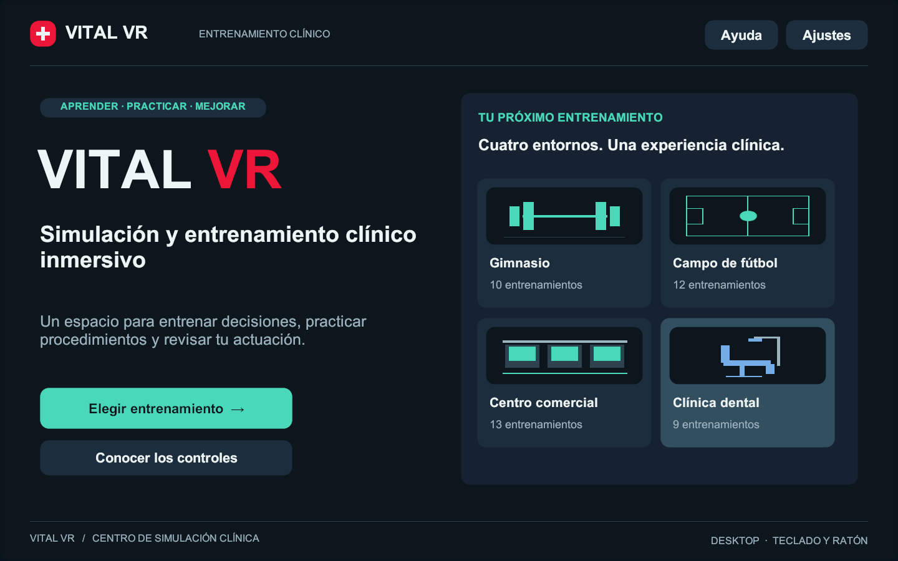

# VITAL VR — experiencia de entrenamiento

Identidad: **VITAL VR**. Portada: **Simulación y entrenamiento clínico inmersivo**.

## Arquitectura revisada antes de la implementación

El arranque existente carga Bootstrap y TrainingRoom. `ReviewCaseSession` ensambla
el catálogo técnico y las 44 variantes de `MedicalScenarios.json` y aplica uno de
cuatro módulos de ambiente. `ScenarioManager` conecta el dominio con el paciente,
las acciones y la evaluación. `MedicalScenarioRuntime` conserva evolución, reglas,
scoring, errores, omisiones, cronología y debrief. Los instrumentos y RCP/DEA se
conectan a ese mismo motor mediante `MedicalProcedureRig`.

El escritorio dibujaba un panel IMGUI que mezclaba navegación, acciones, datos,
depuración y resultados. VR usaba TrainingPanel y ReviewCasePanel. Escape ocultaba
el panel sin detener el caso. Las lecturas de ayuda pertenecían a esos paneles y
a la tablet del equipo; no existía un monitor independiente de la navegación.

## Nueva capa de producto

`TrainingExperience` se instala al crear la sesión de TrainingRoom. La escena
base sigue cargándose para conservar referencias, XR, equipo y pruebas. Mientras
se navega por bienvenida, catálogo, briefing y resultados, la cámara solo muestra
la interfaz sobre un fondo neutro. El mundo clínico se revela al iniciar.
Navegar o preparar un caso no selecciona ni inicia el motor; `BeginTraining`
aplica la selección y llama a las mismas operaciones que utilizaba la demo.

Los componentes de la interfaz anterior se conservan para escenas y pruebas
compatibles, pero su Canvas y raycasters quedan desactivados. La nueva interfaz
de escritorio sustituye al antiguo OnGUI; movimiento y manejo de objetos siguen
en DesktopDemoController.

- `TrainingExperience.cs`: navegación, sesión, visibilidad, input y lecturas.
- `TrainingExperience.Layout.cs`: componentes visuales y presentación espacial.
- `TrainingExperience.Pages.cs`: bienvenida, entornos, catálogo, briefing, ayuda,
  preferencias y pausa.
- `TrainingExperience.Clinical.cs`: monitor, ficha, acciones y resultados.
- `TrainingExperience.Validation.cs`: recorrido de aceptación opcional del player.

No se modifican los datos del catálogo ni el motor médico puro. La instrumentación
de lecturas publica una copia de la adquisición aceptada; no añade acciones,
desenlaces ni puntos. El nombre de producto de Unity pasa a VITAL VR.

## Recorrido

1. Bienvenida con acceso al catálogo y familiarización.
2. Cuatro entornos con ilustraciones esquemáticas, identificadas como tales en el
   código: no son renders ni promesas de un nuevo ambiente 3D.
3. Casos paginados, con filtros por área/dificultad; búsqueda de texto en Desktop.
4. Contexto y elección de práctica guiada o evaluación antes de empezar.
5. Entrenamiento con controles de sesión, monitor independiente, ficha y acciones.
6. Pausa real, confirmación para finalizar/repetir y resultados dedicados.
7. Resumen, acciones, cronología, métricas, referencias y exportación JSON existente.

La familiarización conserva el caso técnico original. Los casos clínicos mantienen
su estado de revisión. Una interfaz de aspecto profesional no cambia ese estado.

## Datos del monitor

En práctica guiada se presenta el snapshot simulado actual. En evaluación las
lecturas de presión arterial, SpO2 y glucemia aparecen tras una adquisición
aceptada con el instrumento correspondiente. Se guarda copia del valor y tiempo
de adquisición, se distingue de monitorización continua y se limpia al cambiar
de intento. FC y FR muestran «No monitorizado» en evaluación: no se infiere una
medición numérica a partir de una acción que no la proporciona. No se dibujan
ondas ECG ficticias. Los estados de ausencia de perfusión mantienen «Sin lectura».

## Pausa e interacción

ScenarioManager adapta el reloj existente descontando el tiempo pausado. El motor
puro conserva sus reglas y su reloj monotónico. La pausa detiene `Time.timeScale`
para adquisiciones, animaciones y análisis DEA; se conserva y restaura su valor
previo. Mientras hay pausa no se aceptan acciones ni avances manuales de tiempo.
RCP utiliza el mismo reloj activo para que el tiempo de menú no infle sus métricas.

En Desktop, Escape alterna práctica/pausa. Los clics sobre UI no se propagan a la
interacción del paciente o equipo. En VR se conserva el XR UI Input Module, los
mandos y XR Interaction Toolkit 3.3.2. La locomoción se suspende en los menús y un
filtro evita nuevas selecciones de objetos ocultos o durante la pausa. La interfaz
usa Canvas world-space; el seguimiento del visor permanece activo. B/Y centra la
interfaz y alterna la pausa durante una sesión. Los paneles no están fijados a la
cabeza. El volumen y los recordatorios se ajustan para la sesión actual.

Los informes nuevos usan `Application.persistentDataPath/ReviewResults`. El cambio
del nombre de producto hace que Unity utilice la carpeta VITAL VR. Los informes
anteriores permanecen en la carpeta del producto anterior; no se borran ni se
reescriben automáticamente.

## Verificación reproducible

Desde la raíz del proyecto:

```powershell
powershell -NoProfile -ExecutionPolicy Bypass -File .\tools\Test-Core.ps1
powershell -NoProfile -ExecutionPolicy Bypass -File .\tools\Test-Experience.ps1 -Mode EditMode
powershell -NoProfile -ExecutionPolicy Bypass -File .\tools\Test-Experience.ps1 -Mode PlayMode
powershell -NoProfile -ExecutionPolicy Bypass -File .\tools\Test-Experience.ps1 -Mode Windows
powershell -NoProfile -ExecutionPolicy Bypass -File .\tools\Test-Experience.ps1 -Mode Android
```

El player admite `-vital-ux-smoke -vital-capture-directory <ruta>`: recorre las
pantallas, emite clicks UI, verifica pausa, scoring y lecturas, guarda capturas
reales y registra `VITAL_UX_SMOKE PASS` o `FAIL`. El recorrido anterior de 45 casos
continúa disponible mediante `-demo-smoke-test`. Ninguno sustituye pruebas con
mandos físicos ni medición de comodidad y rendimiento en Quest 3.

Referencias de diseño y compatibilidad:

- [Unity XRI 3.3: UI canvases](https://docs.unity3d.com/Packages/com.unity.xr.interaction.toolkit@3.3/manual/ui-setup.html).
- [Meta: colocación y comodidad de UI](https://developers.meta.com/horizon/design/mr-design-guideline/).
- [INACSL: preparación, objetivos y debriefing](https://www.inacsl.org/healthcare-simulation-standards-of-best-practice-).

## Evidencia de esta entrega

- Dominio: **27/27** pruebas aprobadas.
- Unity EditMode: **124/124**; Unity PlayMode: **13/13**.
- Ejecutable Windows: recorrido nuevo aprobado a **1440×900** y **1280×720**.
- Regresión del player: **DESKTOP_SMOKE PASS**, con los 44 casos médicos y la
  familiarización técnica existentes.
- Android: APK de desarrollo **IL2CPP / ARM64** compilado correctamente con
  OpenXR; `Builds/Android/EmergencyVR-20260924-015037.apk`. Pendiente de validar
  controles, legibilidad, comodidad y rendimiento en un Quest 3 físico.
- Los datos `MedicalScenarios.json` y el motor `MedicalScenarioRuntime` no tienen
  cambios. Las pruebas comprueban pausa, intentos separados, lecturas adquiridas,
  RCP y scoring de referencia en los cuatro entornos.

Los resultados XML y logs quedan en `TestResults` (no versionados). El ejecutable
de esta entrega se identifica en `Builds/Windows/latest-build.json`.
La compilación comprobada es `Builds/Windows/20260924-014052/EmergencyVR.exe`.

```powershell
powershell -NoProfile -ExecutionPolicy Bypass -File .\tools\Test-ExperiencePlayer.ps1 -Mode Experience
powershell -NoProfile -ExecutionPolicy Bypass -File .\tools\Test-ExperiencePlayer.ps1 -Mode Experience -Width 1280 -Height 720
powershell -NoProfile -ExecutionPolicy Bypass -File .\tools\Test-ExperiencePlayer.ps1 -Mode Regression
```

Capturas reales del ejecutable, sin retoque:

| Pantalla | Captura |
| --- | --- |
| Bienvenida VITAL VR | [Abrir](screenshots/experience/01-welcome.png) |
| Selección de entorno | [Abrir](screenshots/experience/02-environments.png) |
| Preparación del caso | [Abrir](screenshots/experience/04-briefing.png) |
| Entrenamiento y monitor | [Abrir](screenshots/experience/05-training.png) |
| Resultados | [Abrir](screenshots/experience/08-results.png) |


