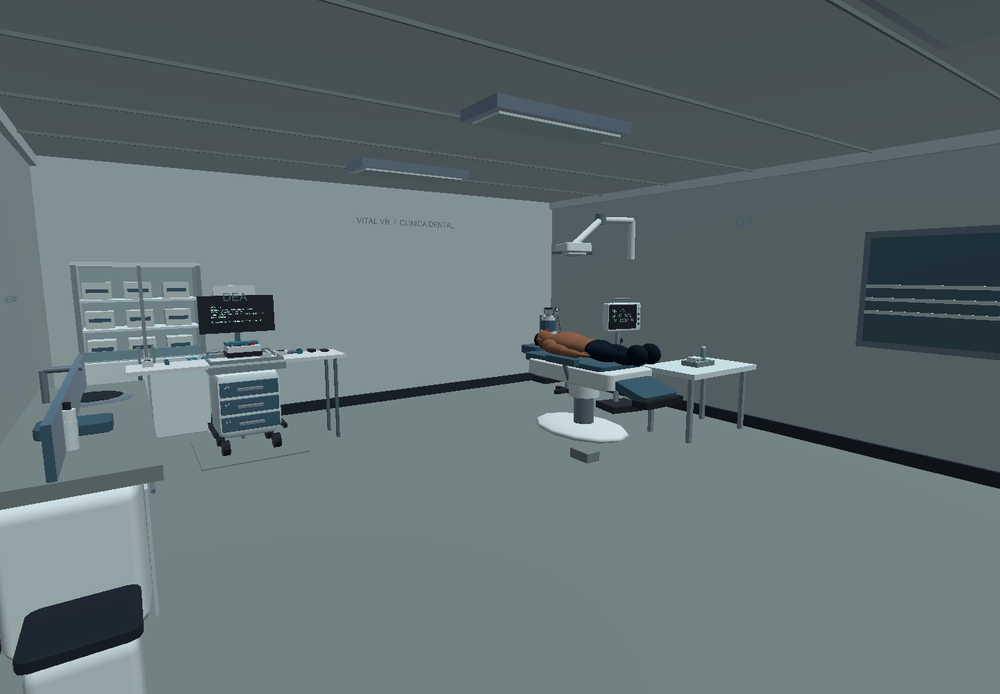
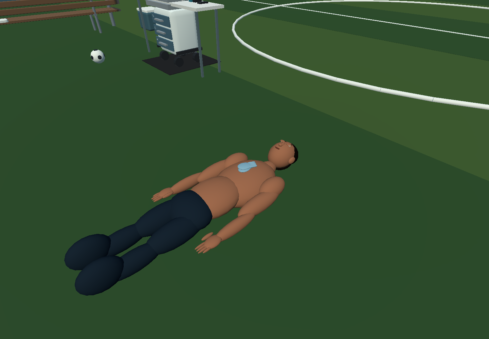
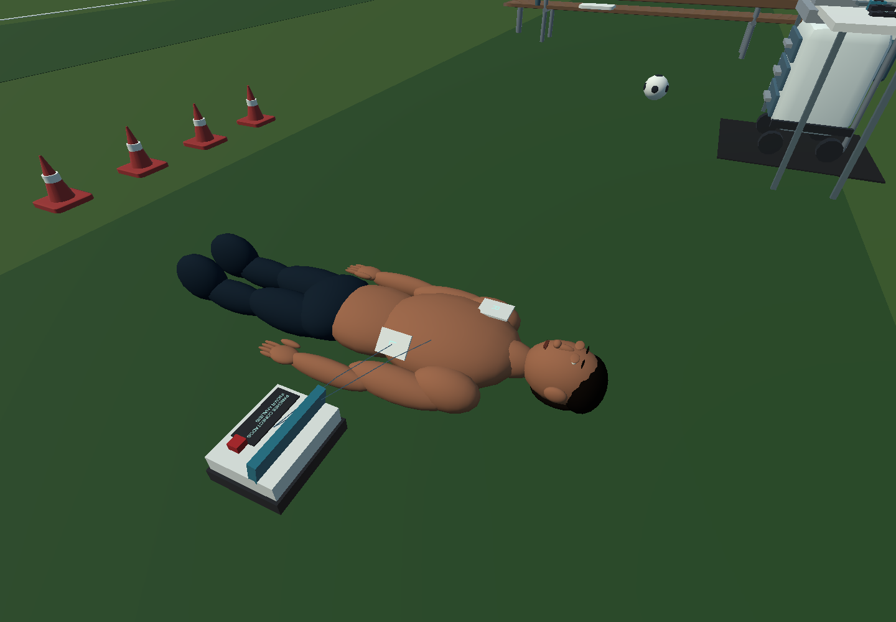

# Capturas de Vital VR

## Branding web

Capturas reales del portal local en Edge, con identidad navy, rojo y cyan.
La administración se revisó con una base de datos temporal vacía en memoria.

| Vista | Captura |
| --- | --- |
| Guía de identidad | [Abrir](vital-brand-guide.png) |
| Portada escritorio | [Abrir](vital-brand-home.png) |
| Portada móvil | [Abrir](vital-brand-mobile.png) |
| Acceso administración | [Abrir](vital-brand-login.png) |
| Administración | [Abrir](vital-brand-admin.png) |
| Formulario administración | [Abrir](vital-brand-admin-form.png) |

Ver [recursos, alcance y validación del branding](../BRANDING.md).

## Simulador Windows 0.4.0, antes de este branding

Renderizadas por la demo Windows mediante `-demo-smoke-test -demo-capture-directory`.
Son capturas del proyecto ejecutándose, no imágenes conceptuales. El paciente,
manos e instrumentos siguen siendo provisionales: **NEEDS_ASSET** para calidad comercial.

| Ambiente / interacción | Captura |
| --- | --- |
| Gimnasio | [Abrir](vital-gym.png) |
| Campo de fútbol | [Abrir](vital-football.png) |
| Centro comercial | [Abrir](vital-mall.png) |
| Clínica dental | [Abrir](vital-dental.png) |
| Compresión torácica virtual | [Abrir](vital-cpr.png) |
| DEA y parches colocados | [Abrir](vital-aed.png) |
| Primer plano del paciente | [Abrir](vital-patient-closeup.png) |

El smoke valida componentes por automatización. Estas imágenes no acreditan
una prueba manual con mandos, calibración clínica ni rendimiento en Quest 3.
